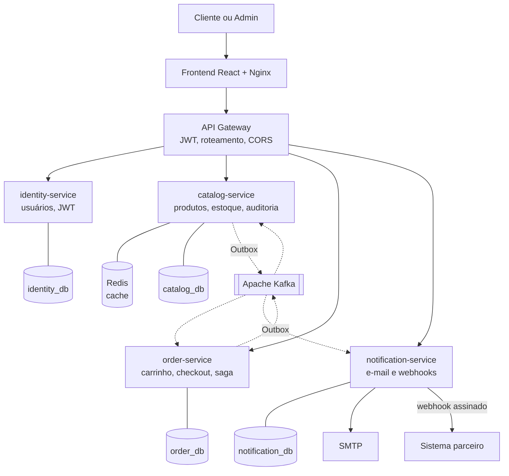
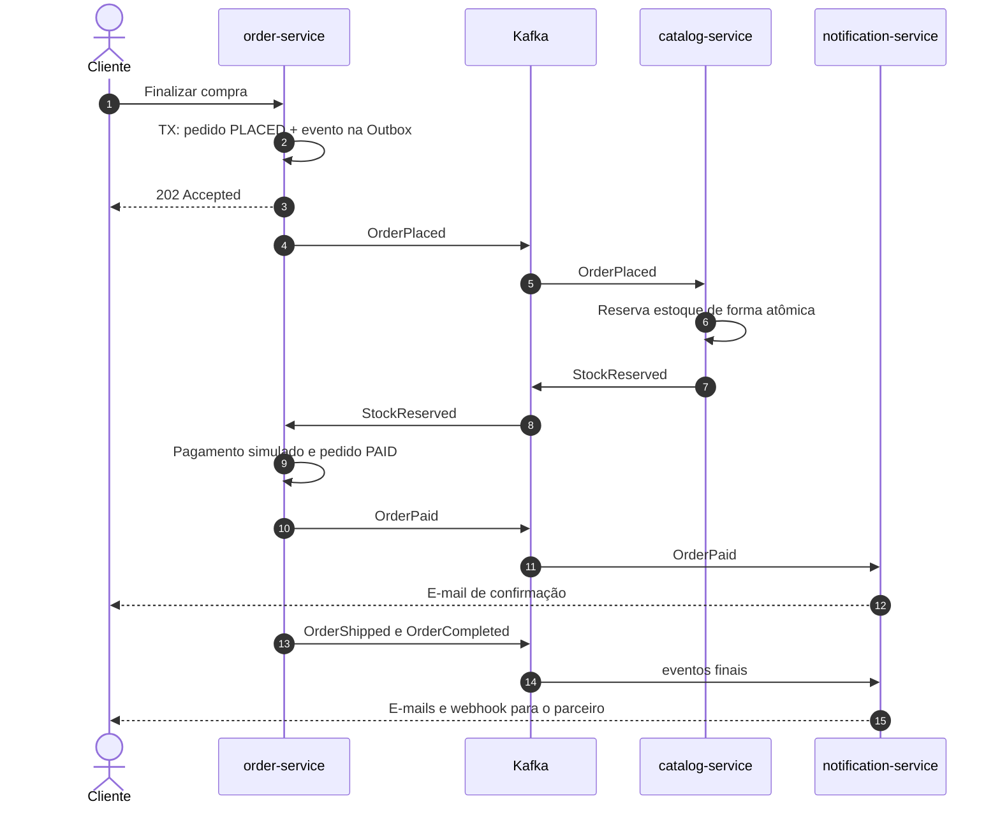
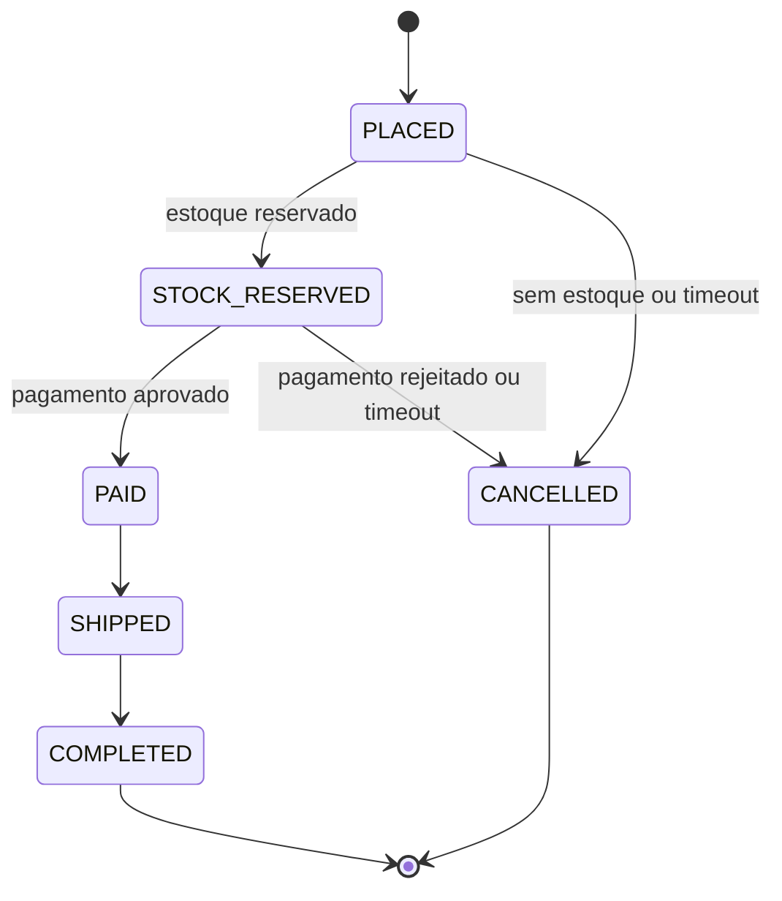

# ShopFlow

> E-commerce full-stack construído para demonstrar **arquitetura de software distribuída**: checkout assíncrono, saga com compensação, Transactional Outbox, Kafka, API Gateway, cache, auditoria e webhooks. Tudo documentado com diagramas e decisões justificadas.

## Sobre o projeto

O ShopFlow é um e-commerce fictício. O valor do projeto está menos nas telas e mais em **como o sistema se comporta quando as coisas dão errado**: Kafka fora do ar, mensagem duplicada, duas pessoas comprando a última unidade, pagamento recusado depois da reserva de estoque.

O projeto mostra tanto o que **foi implementado** quanto o que foi **apenas projetado** (observabilidade, segurança avançada, idempotência de checkout, resiliência), sempre com a diferença explícita:

| Marca | Significado                         |
| ----- | ----------------------------------- |
| 🟢    | Implementado em código              |
| 🔵    | Planejado e documentado, sem código |

> **Estado atual:** o projeto segue a abordagem _documentação primeiro_. Os documentos abaixo estão completos. Os comandos da seção "Como rodar" passam a valer a partir da Fase 0 do [roadmap](docs/IMPLEMENTATION.md).

## Documentação

| Documento                                   | Conteúdo                                                                                                             |
| ------------------------------------------- | -------------------------------------------------------------------------------------------------------------------- |
| [ARCHITECTURE.md](docs/ARCHITECTURE.md)     | Diagramas C4, fluxos de dados, máquinas de estado, modelos de dados, contratos, implantação, itens planejados e ADRs |
| [REQUIREMENTS.md](docs/REQUIREMENTS.md)     | Requisitos funcionais e não funcionais, regras de negócio, riscos e mitigações, rastreabilidade                      |
| [IMPLEMENTATION.md](docs/IMPLEMENTATION.md) | Fases de implementação, cada uma com entregável executável                                                           |

## Visão geral da arquitetura



Mais detalhes em [ARCHITECTURE.md](docs/ARCHITECTURE.md): C4 completo (contexto, contêineres e componentes).

## O fluxo principal: uma compra



O fluxo completo, os cenários de falha e todos os demais diagramas estão na [seção 6 do ARCHITECTURE.md](docs/ARCHITECTURE.md#6-fluxos-de-dados-detalhados).

## Estados do pedido



## Padrões demonstrados

| Problema                                   | Solução                                              | Onde ver                       |
| ------------------------------------------ | ---------------------------------------------------- | ------------------------------ |
| Pedido salvo e evento perdido (dual write) | 🟢 Transactional Outbox                              | ARCHITECTURE 4.1, 6.7, ADR-004 |
| Mensagem entregue mais de uma vez          | 🟢 Consumidor idempotente                            | 6.14c, ADR-005                 |
| Duas pessoas comprando a última unidade    | 🟢 `UPDATE` condicional atômico e `CHECK`            | 6.8                            |
| Falha no meio de um processo distribuído   | 🟢 Saga coreografada com compensação                 | 6.9, 6.14d, ADR-006            |
| Kafka fora do ar                           | 🟢 Eventos ficam `PENDING` e são publicados depois   | 6.14a                          |
| Mensagem que nunca é processada            | 🟢 Retry com backoff e Dead Letter Topic             | 6.14b                          |
| Leituras frequentes do catálogo            | 🟢 Cache-aside com Redis                             | 6.3, ADR-009                   |
| Quem alterou o quê e quando                | 🟢 Auditoria na mesma transação                      | 6.4, ADR-010                   |
| Integração com sistema externo             | 🟢 Webhooks assinados com retry                      | 6.12, ADR-011                  |
| Ponto único de entrada                     | 🟢 API Gateway com JWT RS256 e JWKS                  | 4.5, 6.2, ADR-007              |
| Observabilidade                            | 🔵 OpenTelemetry, Prometheus, Grafana, Loki          | 11.1                           |
| Abuso e força bruta                        | 🔵 Rate limiting, blacklist de IPs, Blind Login, 2FA | 11.2                           |
| Cobrança ou pedido duplicados em retry     | 🔵 Idempotency-Key                                   | 11.3                           |
| Falha em cascata                           | 🔵 Circuit Breaker, Bulkhead, retry                  | 11.4                           |
| Busca inteligente                          | 🔵 OpenSearch, indexação assíncrona via Debezium     |

Serviços opcionais:

| Serviço                  | Inicialização      | Uso                                    |
| ------------------------ | ------------------ | -------------------------------------- |
| Kafka Connect + Debezium | `--profile cdc`    | Captura alterações do PostgreSQL       |
| OpenSearch               | `--profile search` | Busca fuzzy, autocomplete e relevância |
| Kafka UI                 | Sempre ativo       | Inspeção de tópicos e DLT              |
| MailHog                  | Sempre ativo       | Inspeção de e-mails                    |
| WireMock                 | Sempre ativo       | Simulação do parceiro de webhook       |

Para desenvolvimento básico, PostgreSQL continua sendo suficiente. OpenSearch só será usado quando a busca inteligente entrar no roadmap.

## Stack tecnológica

| Camada                         | Tecnologia                                                                                                     |
| ------------------------------ | -------------------------------------------------------------------------------------------------------------- |
| Backend                        | Java 21, Spring Boot 3, Spring Cloud Gateway, Spring Security (Resource Server), Spring Data JPA, Spring Kafka |
| Banco de dados                 | PostgreSQL 16 (um banco lógico por serviço), Flyway                                                            |
| Cache                          | Redis 7                                                                                                        |
| Mensageria                     | Apache Kafka (KRaft)                                                                                           |
| Frontend                       | React, TypeScript, Vite, TanStack Query, servido por Nginx                                                     |
| Testes                         | JUnit 5, Testcontainers, ArchUnit, Awaitility, Vitest, k6 (carga leve)                                         |
| Infraestrutura                 | Docker, Docker Compose, GitHub Actions                                                                         |
| Ferramentas de desenvolvimento | Kafka UI, MailHog (SMTP), WireMock (parceiro de webhook)                                                       |
| Planejado 🔵                   | OpenTelemetry, Prometheus, Grafana, Loki, Tempo, Resilience4j, Bucket4j                                        |

## Como rodar

> Disponível a partir da Fase 0 do roadmap.

Pré-requisitos: Docker 24+ com Docker Compose v2.

```bash
git clone https://github.com/<seu-usuario>/shopflow.git
cd shopflow
docker compose -f infra/docker-compose.yml up -d --build
```

Depois de alguns instantes, todos os serviços ficam saudáveis:

| Recurso                        | URL                                             |
| ------------------------------ | ----------------------------------------------- |
| Loja e painel admin            | http://localhost:3000                           |
| API Gateway                    | http://localhost:8080                           |
| Swagger de cada serviço        | `http://localhost:{8081..8084}/swagger-ui.html` |
| Kafka UI                       | http://localhost:8090                           |
| MailHog (e-mails)              | http://localhost:8025                           |
| WireMock (parceiro de webhook) | http://localhost:8089                           |

Usuários de demonstração (apenas para ambiente local):

| Perfil  | E-mail                  | Senha            |
| ------- | ----------------------- | ---------------- |
| Admin   | `admin@shopflow.dev`    | `Admin@12345`    |
| Cliente | `customer@shopflow.dev` | `Customer@12345` |

Para parar e limpar tudo: `docker compose -f infra/docker-compose.yml down -v`.

## Roteiro de demonstração

| #   | Cenário                                                                                   | O que observar                                                             |
| --- | ----------------------------------------------------------------------------------------- | -------------------------------------------------------------------------- |
| 1   | **Caminho feliz:** compre com cenário `APPROVE`                                           | Status avança até `COMPLETED`. E-mails no MailHog. Webhook no WireMock     |
| 2   | **Sem estoque:** compre mais unidades que o disponível                                    | Pedido vai a `CANCELLED` (`OUT_OF_STOCK`) e nada é cobrado                 |
| 3   | **Pagamento rejeitado:** compre com cenário `REJECT`                                      | Pedido cancelado e estoque devolvido (compensação)                         |
| 4   | **Kafka fora do ar:** `docker compose stop kafka`, faça uma compra e depois `start kafka` | Checkout responde 202. O evento fica `PENDING` e é publicado na volta      |
| 5   | **Evento duplicado:** reenvie uma mensagem pelo Kafka UI                                  | Um único efeito no banco                                                   |
| 6   | **Auditoria:** como admin, altere o preço de um produto                                   | Registro com valor antes e depois. Pedidos antigos mantêm o preço original |
| 7   | **Cache:** consulte o catálogo duas vezes                                                 | Header `X-Cache: MISS` e depois `HIT`. Após editar, volta a `MISS`         |
| 8   | **Webhook com falha:** configure um endpoint que responde 500                             | Retries com backoff e estado `DEAD`. Reenvio manual pelo admin             |

## Estrutura do projeto

```text
shopflow/
├── services/
│   ├── api-gateway/            # Spring Cloud Gateway
│   ├── identity-service/       # usuários, login, JWT, JWKS
│   ├── catalog-service/        # categorias, produtos, estoque, auditoria, cache
│   ├── order-service/          # carrinho, checkout, saga, pagamento e entrega simulados
│   └── notification-service/   # e-mails e webhooks
├── libs/
│   ├── event-contracts/        # envelope e tipos de evento compartilhados
│   └── outbox-starter/         # Outbox, relay e IdempotencyGuard reutilizáveis
├── frontend/                   # React + TypeScript (loja e painel admin)
├── infra/
│   ├── docker-compose.yml
│   ├── postgres/               # scripts de criação dos bancos
│   ├── kafka/                  # criação de tópicos e DLTs
│   ├── nginx/
│   └── wiremock/               # stubs do parceiro de webhook
├── docs/
│   ├── ARCHITECTURE.md
│   ├── REQUIREMENTS.md
│   ├── IMPLEMENTATION.md
│   └── adr/                    # ADRs em arquivos individuais (opcional)
├── README.md
├── ARCHITECTURE.md
├── REQUIREMENTS.md
└── IMPLEMENTATION.md
```

Estrutura interna de cada microsserviço:

```text
<service>/src/main/java/dev/shopflow/<service>/
├── domain/
│   ├── model/
│   ├── service/
│   └── exception/
├── application/
│   ├── port/
│   │   ├── in/
│   │   └── out/
│   └── service/
├── adapter/
│   ├── in/
│   │   ├── web/
│   │   └── messaging/
│   └── out/
│       ├── persistence/
│       ├── messaging/
│       └── client/
└── config/
```

A regra de dependência segue Ports and Adapters: o domínio não conhece
frameworks ou infraestrutura; adapters dependem de ports; e a aplicação
orquestra os casos de uso.

## Convenções

- Commits no padrão Conventional Commits.
- Migrações versionadas com Flyway, uma pasta por serviço.
- Identificadores UUID v7.
- Erros de API no formato RFC 9457 (Problem Details).
- Todo evento carrega `eventId`, `correlationId` e `eventVersion`.

## Licença

MIT
