# Arquitetura do ShopFlow

Este documento descreve **como o ShopFlow funciona**, principalmente por meio de diagramas. Todos os diagramas usam Mermaid e são renderizados nativamente pelo GitHub.

**Legenda de status usada em todo o documento**

| Marca           | Significado                                                                     |
| --------------- | ------------------------------------------------------------------------------- |
| 🟢 Implementado | Existe (ou existirá) como código executável no repositório                      |
| 🔵 Planejado    | Está projetado e documentado, mas **não** tem código. Demonstra visão sistêmica |

---

## Sumário

1. [Princípios e visão geral](#1-princípios-e-visão-geral)
2. [C4 nível 1: Contexto](#2-c4-nível-1-contexto)
3. [C4 nível 2: Contêineres](#3-c4-nível-2-contêineres)
4. [C4 nível 3: Componentes](#4-c4-nível-3-componentes)
5. [Catálogo de eventos](#5-catálogo-de-eventos)
6. [Fluxos de dados detalhados](#6-fluxos-de-dados-detalhados)
7. [Máquinas de estado](#7-máquinas-de-estado)
8. [Modelos de dados](#8-modelos-de-dados)
9. [Contratos de API](#9-contratos-de-api)
10. [Implantação e CI/CD](#10-implantação-e-cicd)
11. [Planejado, sem código](#11-planejado-sem-código)
    11.1 [Observabilidade](#111-observabilidade)
    11.2 [Segurança avançada](#112-segurança-avançada)
    11.3 [Idempotência de requisições](#113-idempotência-de-requisições)
    11.4 [Resiliência](#114-resiliência)
    11.5 [CDC e busca inteligente](#115-cdc-e-busca-inteligente)
    11.6 [Kong Gateway](#116-kong-gateway)
12. [Architecture Decision Records](#12-architecture-decision-records-adrs)
13. [Estratégia de testes](#13-estratégia-de-testes)

---

## 1. Princípios e visão geral

| Princípio                                         | Como aparece no projeto                                                                                 |
| ------------------------------------------------- | ------------------------------------------------------------------------------------------------------- |
| Consistência onde importa, eventual onde possível | Estoque e pedido são atômicos dentro do seu serviço. Entre serviços, a consistência é eventual via saga |
| Sem dual write                                    | Todo evento nasce de uma linha na tabela Outbox, gravada na mesma transação do dado de negócio          |
| Ownership de dados                                | Cada serviço tem seu próprio banco. Nenhum serviço lê o banco de outro                                  |
| Falha é o caso normal                             | Retries com backoff, DLT, idempotência de consumidores e compensação de saga                            |
| Cada peça justifica sua existência                | Cada tecnologia tem um ADR e um problema concreto que resolve                                           |
| Simulação honesta                                 | Pagamento, entrega e integrações externas são simulados, mas seguem contratos reais                     |

### Mapa mental do sistema

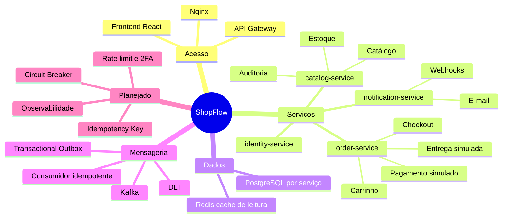
```mermaid
mindmap
  root((ShopFlow))
    Acesso
      Frontend React
      Nginx
      API Gateway
    Serviços
      identity-service
      catalog-service
        Catálogo
        Estoque
        Auditoria
      order-service
        Carrinho
        Checkout
        Pagamento simulado
        Entrega simulada
      notification-service
        E-mail
        Webhooks
    Dados
      PostgreSQL por serviço
      Redis cache de leitura
    Mensageria
      Kafka
      Transactional Outbox
      Consumidor idempotente
      DLT
    Planejado
      Observabilidade
      Rate limit e 2FA
      Idempotency Key
      Circuit Breaker
```

### Índice de diagramas

| #   | Diagrama                                                                                                      | Seção       |
| --- | ------------------------------------------------------------------------------------------------------------- | ----------- |
| 1   | Contexto (C4-1)                                                                                               | 2           |
| 2   | Contêineres (C4-2)                                                                                            | 3           |
| 3   | Componentes: Outbox + Kafka, order, catalog, notification, identity + gateway (C4-3)                          | 4           |
| 4   | Mapa produtor → tópico → consumidor                                                                           | 5           |
| 5   | Sequências: auth, cache, preço, carrinho, checkout, outbox, reserva, pagamento, entrega, notificação, webhook | 6           |
| 6   | Saga ponta a ponta e cenários de falha                                                                        | 6.13 e 6.14 |
| 7   | Máquinas de estado                                                                                            | 7           |
| 8   | ER por serviço                                                                                                | 8           |
| 9   | Implantação, rede e CI/CD                                                                                     | 10          |
| 10  | Observabilidade, segurança, idempotência, resiliência, BFF, produção (planejados)                             | 11          |

---

## 2. C4 nível 1: Contexto

Quem usa o ShopFlow e com quais sistemas externos ele conversa.

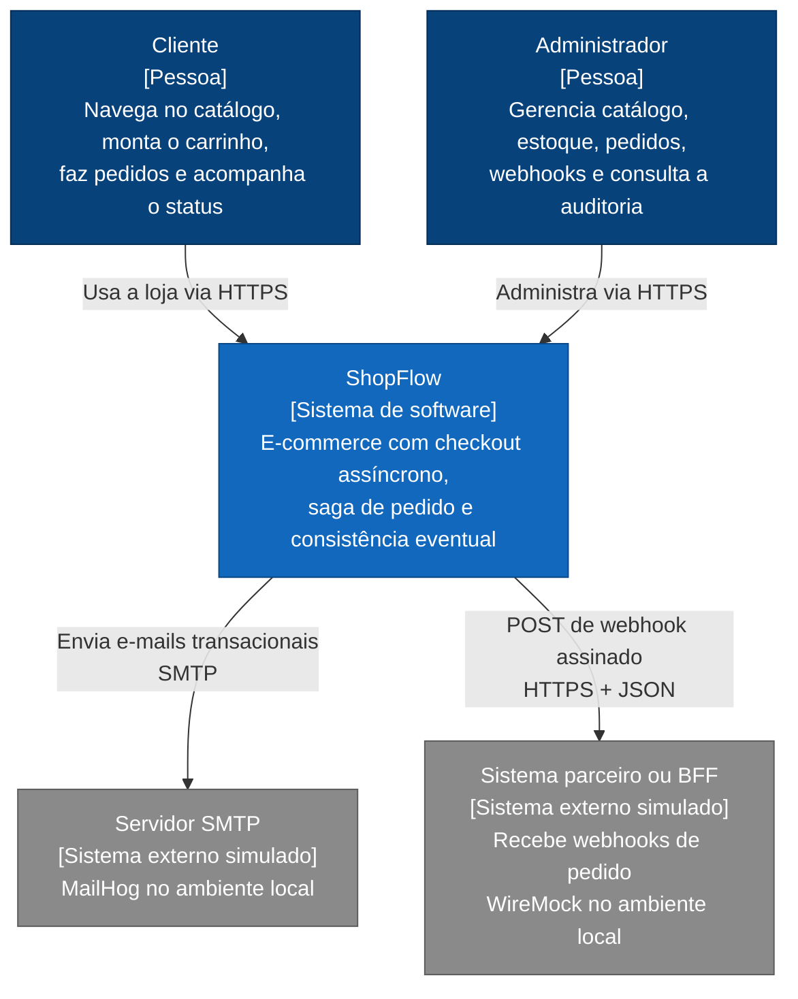
```mermaid
flowchart TB
    customer["Cliente<br/>[Pessoa]<br/>Navega no catálogo, monta o carrinho,<br/>faz pedidos e acompanha o status"]:::person
    admin["Administrador<br/>[Pessoa]<br/>Gerencia catálogo, estoque, pedidos,<br/>webhooks e consulta a auditoria"]:::person

    shopflow["ShopFlow<br/>[Sistema de software]<br/>E-commerce com checkout assíncrono,<br/>saga de pedido e consistência eventual"]:::system

    smtp["Servidor SMTP<br/>[Sistema externo simulado]<br/>MailHog no ambiente local"]:::external
    partner["Sistema parceiro ou BFF<br/>[Sistema externo simulado]<br/>Recebe webhooks de pedido<br/>WireMock no ambiente local"]:::external

    customer -->|"Usa a loja via HTTPS"| shopflow
    admin -->|"Administra via HTTPS"| shopflow
    shopflow -->|"Envia e-mails transacionais<br/>SMTP"| smtp
    shopflow -->|"POST de webhook assinado<br/>HTTPS + JSON"| partner

    classDef person fill:#08427b,stroke:#052e56,color:#ffffff
    classDef system fill:#1168bd,stroke:#0b4884,color:#ffffff
    classDef external fill:#8a8a8a,stroke:#5c5c5c,color:#ffffff
```

### Casos de uso por ator

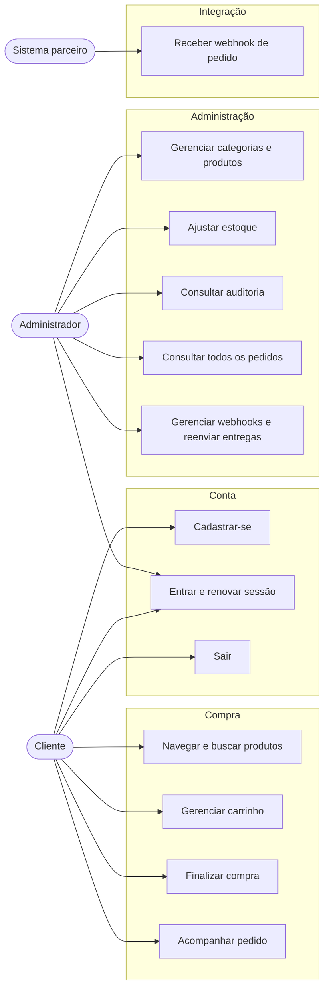
```mermaid
flowchart LR
    C(["Cliente"])
    A(["Administrador"])
    P(["Sistema parceiro"])

    subgraph Conta
        UC1["Cadastrar-se"]
        UC2["Entrar e renovar sessão"]
        UC3["Sair"]
    end
    subgraph Compra
        UC4["Navegar e buscar produtos"]
        UC5["Gerenciar carrinho"]
        UC6["Finalizar compra"]
        UC7["Acompanhar pedido"]
    end
    subgraph Administração
        UC8["Gerenciar categorias e produtos"]
        UC9["Ajustar estoque"]
        UC10["Consultar auditoria"]
        UC11["Consultar todos os pedidos"]
        UC12["Gerenciar webhooks e reenviar entregas"]
    end
    subgraph Integração
        UC13["Receber webhook de pedido"]
    end

    C --> UC1 & UC2 & UC3 & UC4 & UC5 & UC6 & UC7
    A --> UC2 & UC8 & UC9 & UC10 & UC11 & UC12
    P --> UC13
```

---

## 3. C4 nível 2: Contêineres

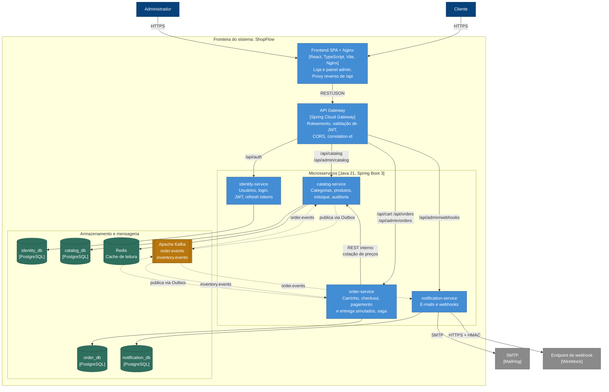
```mermaid
flowchart TB
    customer["Cliente"]:::person
    admin["Administrador"]:::person
    smtp["SMTP<br/>[MailHog]"]:::external
    partner["Endpoint de webhook<br/>[WireMock]"]:::external

    subgraph sf["Fronteira do sistema: ShopFlow"]
        direction TB
        spa["Frontend SPA + Nginx<br/>[React, TypeScript, Vite, Nginx]<br/>Loja e painel admin.<br/>Proxy reverso de /api"]:::container
        gw["API Gateway<br/>[Spring Cloud Gateway]<br/>Roteamento, validação de JWT,<br/>CORS, correlation-id"]:::container

        subgraph svcs["Microsserviços [Java 21, Spring Boot 3]"]
            direction LR
            idsvc["identity-service<br/>Usuários, login,<br/>JWT, refresh tokens"]:::container
            cat["catalog-service<br/>Categorias, produtos,<br/>estoque, auditoria"]:::container
            ord["order-service<br/>Carrinho, checkout, pagamento<br/>e entrega simulados, saga"]:::container
            notif["notification-service<br/>E-mails e webhooks"]:::container
        end

        subgraph data["Armazenamento e mensageria"]
            direction LR
            dbid[("identity_db<br/>[PostgreSQL]")]:::store
            dbcat[("catalog_db<br/>[PostgreSQL]")]:::store
            dbord[("order_db<br/>[PostgreSQL]")]:::store
            dbnot[("notification_db<br/>[PostgreSQL]")]:::store
            redis[("Redis<br/>Cache de leitura")]:::store
            kafka[["Apache Kafka<br/>order.events<br/>inventory.events"]]:::queue
        end
    end

    customer -->|"HTTPS"| spa
    admin -->|"HTTPS"| spa
    spa -->|"REST/JSON"| gw
    gw -->|"/api/auth"| idsvc
    gw -->|"/api/catalog<br/>/api/admin/catalog"| cat
    gw -->|"/api/cart /api/orders<br/>/api/admin/orders"| ord
    gw -->|"/api/admin/webhooks"| notif

    idsvc --> dbid
    cat --> dbcat
    cat --> redis
    ord --> dbord
    notif --> dbnot

    ord -->|"REST interno<br/>cotação de preços"| cat
    ord -.->|"publica via Outbox"| kafka
    cat -.->|"publica via Outbox"| kafka
    kafka -.->|"inventory.events"| ord
    kafka -.->|"order.events"| cat
    kafka -.->|"order.events"| notif

    notif -->|"SMTP"| smtp
    notif -->|"HTTPS + HMAC"| partner

    classDef person fill:#08427b,stroke:#052e56,color:#ffffff
    classDef container fill:#438dd5,stroke:#2e6295,color:#ffffff
    classDef store fill:#2f6f5e,stroke:#1f4a3f,color:#ffffff
    classDef queue fill:#b9770e,stroke:#7e5109,color:#ffffff
    classDef external fill:#8a8a8a,stroke:#5c5c5c,color:#ffffff
```

Linhas contínuas são chamadas síncronas. Linhas pontilhadas são comunicação assíncrona por Kafka.

### Responsabilidades

| Contêiner                   | Responsabilidade                                                                             | Dados que possui          | Status |
| --------------------------- | -------------------------------------------------------------------------------------------- | ------------------------- | ------ |
| Frontend SPA + Nginx        | Interface do cliente e do admin. Faz polling do status do pedido                             | Nenhum (token em memória) | 🟢     |
| api-gateway                 | Ponto único de entrada, roteamento, validação de JWT, CORS, propagação de `X-Correlation-Id` | Nenhum                    | 🟢     |
| identity-service            | Cadastro, login, emissão de JWT (RS256), refresh com rotação, JWKS                           | `identity_db`             | 🟢     |
| catalog-service             | Categorias, produtos, estoque, reservas, auditoria, cache Redis                              | `catalog_db`              | 🟢     |
| order-service               | Carrinho, checkout, saga, pagamento e entrega simulados, histórico de status                 | `order_db`                | 🟢     |
| notification-service        | E-mails transacionais, webhooks assinados, histórico de entregas                             | `notification_db`         | 🟢     |
| PostgreSQL                  | Um banco lógico por serviço na mesma instância (local)                                       |                           | 🟢     |
| Redis                       | Cache-aside de leitura do catálogo. Nunca é fonte de verdade                                 |                           | 🟢     |
| Kafka (KRaft)               | Barramento de eventos de domínio                                                             |                           | 🟢     |
| MailHog, WireMock, Kafka UI | Simulação de SMTP, parceiro de webhook e inspeção de tópicos                                 |                           | 🟢 dev |

---

## 4. C4 nível 3: Componentes

### 4.1 Outbox e fila: como interagem

Este é o coração técnico do projeto. O mesmo desenho vale para `order-service` e `catalog-service` (produtores) por meio do starter `libs/outbox-starter`.

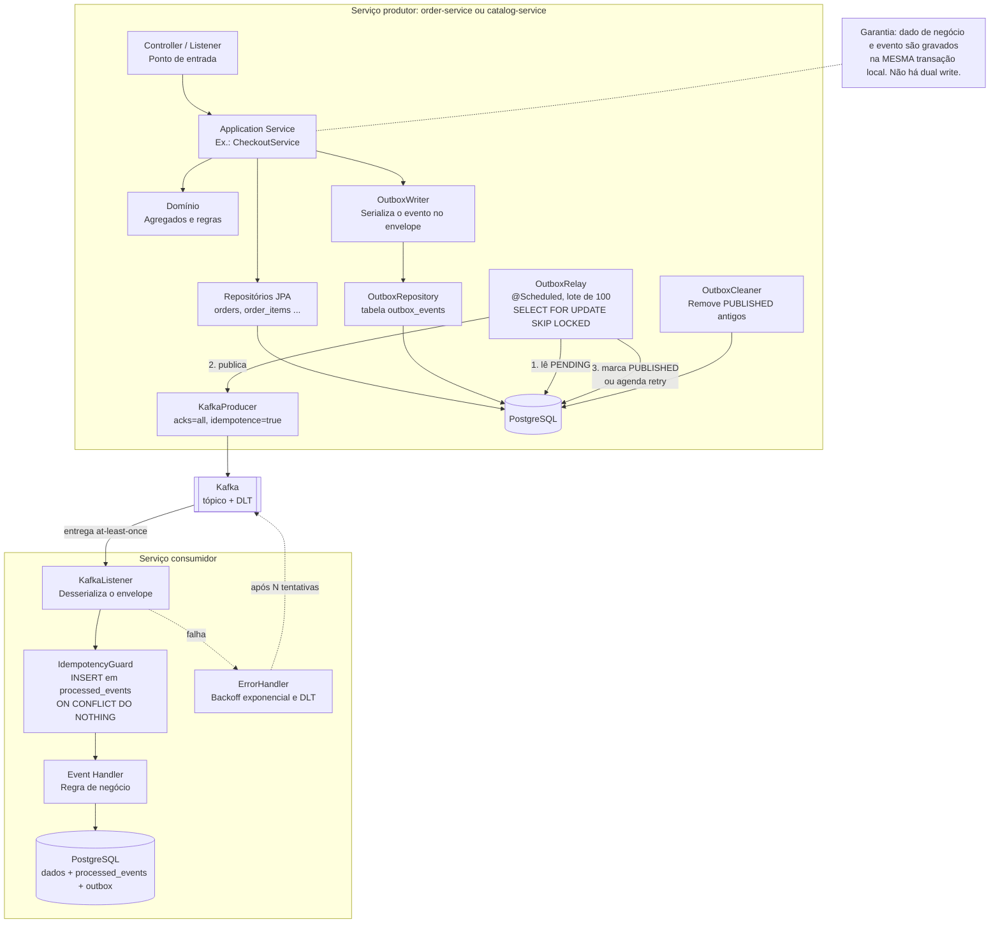
```mermaid
flowchart TB
    subgraph producer["Serviço produtor: order-service ou catalog-service"]
        direction TB
        api["Controller / Listener<br/>Ponto de entrada"]
        app["Application Service<br/>Ex.: CheckoutService"]
        dom["Domínio<br/>Agregados e regras"]
        repo["Repositórios JPA<br/>orders, order_items ..."]
        obw["OutboxWriter<br/>Serializa o evento no envelope"]
        obrepo["OutboxRepository<br/>tabela outbox_events"]
        relay["OutboxRelay<br/>@Scheduled, lote de 100<br/>SELECT FOR UPDATE SKIP LOCKED"]
        clean["OutboxCleaner<br/>Remove PUBLISHED antigos"]
        kp["KafkaProducer<br/>acks=all, idempotence=true"]
        db[("PostgreSQL")]
    end

    kafka[["Kafka<br/>tópico + DLT"]]

    subgraph consumer["Serviço consumidor"]
        direction TB
        kl["KafkaListener<br/>Desserializa o envelope"]
        guard["IdempotencyGuard<br/>INSERT em processed_events<br/>ON CONFLICT DO NOTHING"]
        handler["Event Handler<br/>Regra de negócio"]
        cdb[("PostgreSQL<br/>dados + processed_events + outbox")]
        eh["ErrorHandler<br/>Backoff exponencial e DLT"]
    end

    api --> app --> dom
    app --> repo --> db
    app --> obw --> obrepo --> db
    relay -->|"1. lê PENDING"| db
    relay -->|"2. publica"| kp --> kafka
    relay -->|"3. marca PUBLISHED<br/>ou agenda retry"| db
    clean --> db

    kafka -->|"entrega at-least-once"| kl --> guard --> handler --> cdb
    kl -.->|"falha"| eh -.->|"após N tentativas"| kafka

    note1["Garantia: dado de negócio e evento são gravados<br/>na MESMA transação local. Não há dual write."]
    note1 -.- app
```

| Componente         | Detalhe                                                                                                                                                                                          |
| ------------------ | ------------------------------------------------------------------------------------------------------------------------------------------------------------------------------------------------ |
| `OutboxWriter`     | Roda dentro da transação do caso de uso. Se a transação falha, o evento também não existe                                                                                                        |
| `OutboxRelay`      | Busca `PENDING` com `next_attempt_at <= now()`, publica com `acks=all`, aguarda o ack e marca `PUBLISHED`. Em falha, incrementa `attempts` e aplica backoff: `min(2^attempts s, 5 min) + jitter` |
| `OutboxCleaner`    | Job diário que apaga `PUBLISHED` com mais de 7 dias                                                                                                                                              |
| Chave da mensagem  | `aggregateId` (ex.: `orderId`). Garante ordem por pedido dentro da partição                                                                                                                      |
| `IdempotencyGuard` | Insere `event_id` em `processed_events` **na mesma transação** do efeito. Conflito significa duplicata: ACK sem efeito                                                                           |
| Offset             | Confirmado apenas depois que o handler retorna, ou seja, depois do commit do banco                                                                                                               |
| Erros              | 3 retries com backoff exponencial e depois `<tópico>.DLT`. Exceções não recuperáveis (JSON inválido, transição inválida) vão direto para a DLT                                                   |

### 4.2 order-service

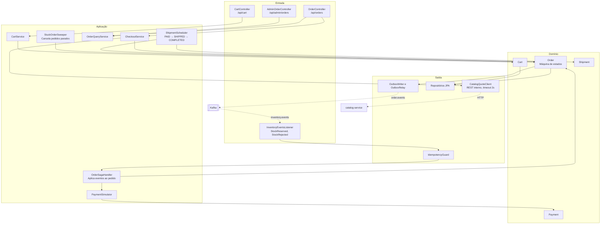
```mermaid
flowchart TB
    subgraph in["Entrada"]
        cartc["CartController<br/>/api/cart"]
        ordc["OrderController<br/>/api/orders"]
        admc["AdminOrderController<br/>/api/admin/orders"]
        invl["InventoryEventsListener<br/>StockReserved, StockRejected"]
    end

    subgraph app["Aplicação"]
        cartsvc["CartService"]
        checkout["CheckoutService"]
        orderq["OrderQueryService"]
        saga["OrderSagaHandler<br/>Aplica eventos ao pedido"]
        paysvc["PaymentSimulator"]
        shipjob["ShipmentScheduler<br/>PAID → SHIPPED → COMPLETED"]
        sweeper["StuckOrderSweeper<br/>Cancela pedidos parados"]
    end

    subgraph domain["Domínio"]
        orderagg["Order<br/>Máquina de estados"]
        cartagg["Cart"]
        payagg["Payment"]
        shipagg["Shipment"]
    end

    subgraph out["Saída"]
        quote["CatalogQuoteClient<br/>REST interno, timeout 2s"]
        repos["Repositórios JPA"]
        outbox["OutboxWriter e OutboxRelay"]
        idem["IdempotencyGuard"]
    end

    cartc --> cartsvc --> cartagg
    ordc --> checkout
    ordc --> orderq
    admc --> orderq
    checkout --> quote
    checkout --> orderagg
    invl --> idem --> saga
    saga --> orderagg
    saga --> paysvc --> payagg
    shipjob --> shipagg
    shipjob --> orderagg
    sweeper --> orderagg
    orderagg --> repos
    cartagg --> repos
    orderagg --> outbox
    quote -.->|"HTTP"| catalogext["catalog-service"]
    outbox -.->|"order.events"| kafkaext[["Kafka"]]
    kafkaext -.->|"inventory.events"| invl
```

### 4.3 catalog-service

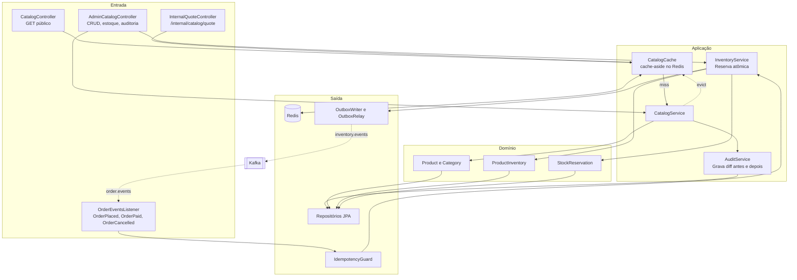
```mermaid
flowchart TB
    subgraph in["Entrada"]
        pubc["CatalogController<br/>GET público"]
        admc["AdminCatalogController<br/>CRUD, estoque, auditoria"]
        intc["InternalQuoteController<br/>/internal/catalog/quote"]
        ordl["OrderEventsListener<br/>OrderPlaced, OrderPaid, OrderCancelled"]
    end

    subgraph app["Aplicação"]
        catsvc["CatalogService"]
        cache["CatalogCache<br/>cache-aside no Redis"]
        invsvc["InventoryService<br/>Reserva atômica"]
        auditsvc["AuditService<br/>Grava diff antes e depois"]
    end

    subgraph domain["Domínio"]
        prod["Product e Category"]
        stock["ProductInventory"]
        resv["StockReservation"]
    end

    subgraph out["Saída"]
        repos["Repositórios JPA"]
        redis[("Redis")]
        outbox["OutboxWriter e OutboxRelay"]
        idem["IdempotencyGuard"]
    end

    pubc --> cache
    cache -->|"miss"| catsvc
    cache <--> redis
    admc --> catsvc
    admc --> invsvc
    intc --> cache
    catsvc --> prod
    catsvc --> auditsvc
    catsvc -.->|"evict"| cache
    ordl --> idem --> invsvc
    invsvc --> stock
    invsvc --> resv
    invsvc --> outbox
    auditsvc --> repos
    prod --> repos
    stock --> repos
    resv --> repos
    outbox -.->|"inventory.events"| kafkaext[["Kafka"]]
    kafkaext -.->|"order.events"| ordl
```

### 4.4 notification-service

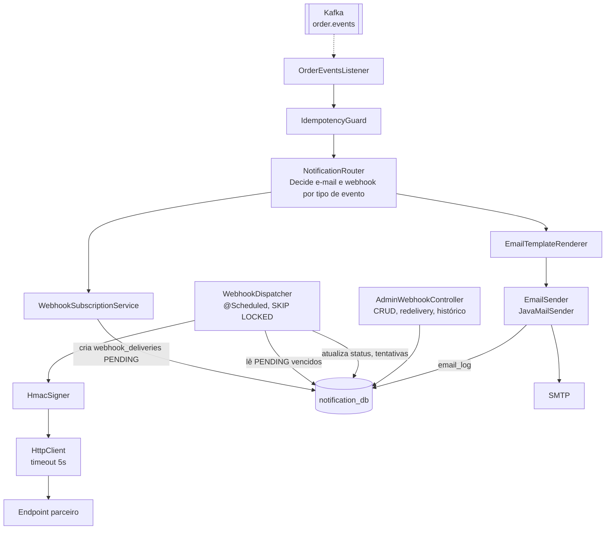
```mermaid
flowchart TB
    kafkaext[["Kafka<br/>order.events"]]
    listener["OrderEventsListener"]
    idem["IdempotencyGuard"]
    router["NotificationRouter<br/>Decide e-mail e webhook por tipo de evento"]
    tpl["EmailTemplateRenderer"]
    mail["EmailSender<br/>JavaMailSender"]
    subs["WebhookSubscriptionService"]
    sign["HmacSigner"]
    disp["WebhookDispatcher<br/>@Scheduled, SKIP LOCKED"]
    http["HttpClient<br/>timeout 5s"]
    adm["AdminWebhookController<br/>CRUD, redelivery, histórico"]
    db[("notification_db")]
    smtp["SMTP"]
    partner["Endpoint parceiro"]

    kafkaext -.-> listener --> idem --> router
    router --> tpl --> mail --> smtp
    router --> subs
    subs -->|"cria webhook_deliveries PENDING"| db
    disp -->|"lê PENDING vencidos"| db
    disp --> sign --> http --> partner
    disp -->|"atualiza status, tentativas"| db
    adm --> db
    mail -->|"email_log"| db
```

### 4.5 identity-service e api-gateway

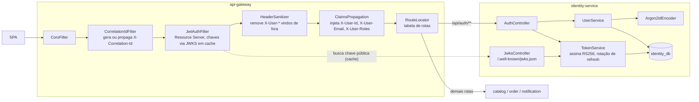
```mermaid
flowchart LR
    spa["SPA"]

    subgraph gw["api-gateway"]
        cors["CorsFilter"]
        corr["CorrelationIdFilter<br/>gera ou propaga X-Correlation-Id"]
        jwtf["JwtAuthFilter<br/>Resource Server, chaves via JWKS em cache"]
        strip["HeaderSanitizer<br/>remove X-User-* vindos de fora"]
        inj["ClaimsPropagation<br/>injeta X-User-Id, X-User-Email, X-User-Roles"]
        route["RouteLocator<br/>tabela de rotas"]
        cors --> corr --> jwtf --> strip --> inj --> route
    end

    subgraph idp["identity-service"]
        authc["AuthController"]
        jwks["JwksController<br/>/.well-known/jwks.json"]
        usrsvc["UserService"]
        tokensvc["TokenService<br/>assina RS256, rotação de refresh"]
        pwd["Argon2idEncoder"]
        db[("identity_db")]
        authc --> usrsvc --> pwd
        authc --> tokensvc
        usrsvc --> db
        tokensvc --> db
        jwks --> tokensvc
    end

    spa --> cors
    route -->|"/api/auth/**"| authc
    jwtf -.->|"busca chave pública (cache)"| jwks
    route -->|"demais rotas"| down["catalog / order / notification"]
```

---

## 5. Catálogo de eventos

### 5.1 Mapa produtor → tópico → consumidor

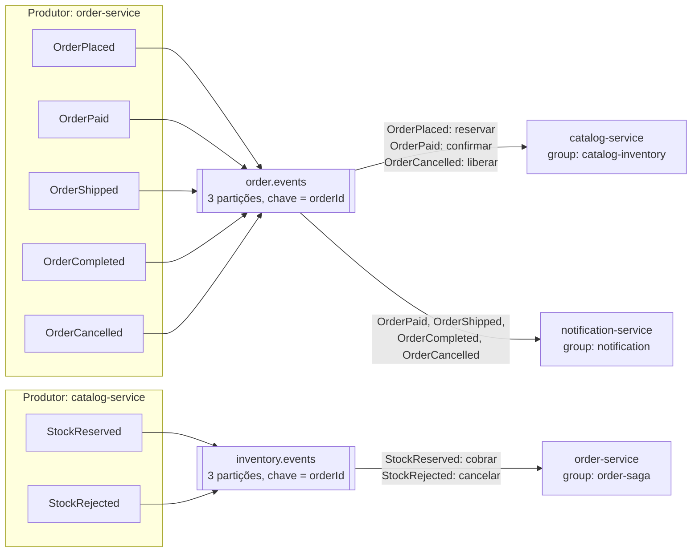
```mermaid
flowchart LR
    subgraph P1["Produtor: order-service"]
        e1["OrderPlaced"]
        e2["OrderPaid"]
        e3["OrderShipped"]
        e4["OrderCompleted"]
        e5["OrderCancelled"]
    end
    t1[["order.events<br/>3 partições, chave = orderId"]]
    subgraph P2["Produtor: catalog-service"]
        e6["StockReserved"]
        e7["StockRejected"]
    end
    t2[["inventory.events<br/>3 partições, chave = orderId"]]

    e1 & e2 & e3 & e4 & e5 --> t1
    e6 & e7 --> t2

    t1 -->|"OrderPlaced: reservar<br/>OrderPaid: confirmar<br/>OrderCancelled: liberar"| c1["catalog-service<br/>group: catalog-inventory"]
    t1 -->|"OrderPaid, OrderShipped,<br/>OrderCompleted, OrderCancelled"| c2["notification-service<br/>group: notification"]
    t2 -->|"StockReserved: cobrar<br/>StockRejected: cancelar"| c3["order-service<br/>group: order-saga"]
```

### 5.2 Tabela de eventos

| Evento           | Tópico             | Produtor | Consumidores          | Efeito                                                            |
| ---------------- | ------------------ | -------- | --------------------- | ----------------------------------------------------------------- |
| `OrderPlaced`    | `order.events`     | order    | catalog               | Tenta reservar estoque de todos os itens                          |
| `StockReserved`  | `inventory.events` | catalog  | order                 | Pedido vai a `STOCK_RESERVED` e o pagamento simulado é executado  |
| `StockRejected`  | `inventory.events` | catalog  | order                 | Pedido vai a `CANCELLED` (motivo `OUT_OF_STOCK`)                  |
| `OrderPaid`      | `order.events`     | order    | catalog, notification | Reserva vira `CONFIRMED`. E-mail de confirmação                   |
| `OrderShipped`   | `order.events`     | order    | notification          | E-mail de envio                                                   |
| `OrderCompleted` | `order.events`     | order    | notification          | E-mail e **webhook** de pedido concluído                          |
| `OrderCancelled` | `order.events`     | order    | catalog, notification | Reserva vira `RELEASED` e o estoque volta. E-mail de cancelamento |

### 5.3 Envelope padrão

```json
{
  "eventId": "0192f1c2-7d3a-7c1e-9a55-3f0d8a6b2c11",
  "eventType": "OrderPlaced",
  "eventVersion": 1,
  "aggregateType": "Order",
  "aggregateId": "0192f1c2-7d39-7b0f-8e11-a2c4d5e6f701",
  "occurredAt": "2026-10-05T14:03:21.482Z",
  "correlationId": "c6e1f7a0-4b9a-4b73-9d0e-0c7f4d9a1b22",
  "causationId": "9a1c3f70-5e62-4b0e-8f10-11d2e3f4a5b6",
  "payload": {
    "orderId": "0192f1c2-7d39-7b0f-8e11-a2c4d5e6f701",
    "customerId": "0192f1b0-1a2b-7c3d-8e4f-5a6b7c8d9e0f",
    "customerEmail": "customer@shopflow.dev",
    "currency": "BRL",
    "totalAmount": "349.80",
    "items": [
      {
        "productId": "0192f100-0001-7000-8000-000000000001",
        "sku": "KB-MECH-01",
        "quantity": 2,
        "unitPrice": "149.90"
      },
      {
        "productId": "0192f100-0001-7000-8000-000000000002",
        "sku": "MS-WL-02",
        "quantity": 1,
        "unitPrice": "50.00"
      }
    ]
  }
}
```

Regras de contrato: campos só podem ser **adicionados** dentro da mesma versão. Mudança incompatível cria `eventVersion` novo e o consumidor suporta as duas durante a migração. Schema Registry é evolução futura (🔵).

---

## 6. Fluxos de dados detalhados

### 6.1 Cadastro, login e refresh 🟢

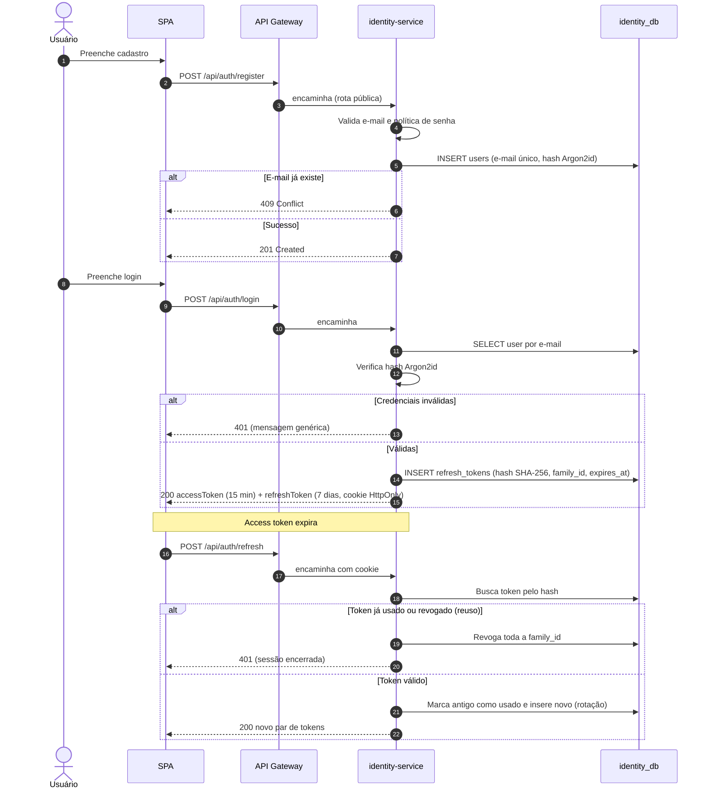
```mermaid
sequenceDiagram
    autonumber
    actor U as Usuário
    participant S as SPA
    participant G as API Gateway
    participant I as identity-service
    participant D as identity_db

    U->>S: Preenche cadastro
    S->>G: POST /api/auth/register
    G->>I: encaminha (rota pública)
    I->>I: Valida e-mail e política de senha
    I->>D: INSERT users (e-mail único, hash Argon2id)
    alt E-mail já existe
        I-->>S: 409 Conflict
    else Sucesso
        I-->>S: 201 Created
    end

    U->>S: Preenche login
    S->>G: POST /api/auth/login
    G->>I: encaminha
    I->>D: SELECT user por e-mail
    I->>I: Verifica hash Argon2id
    alt Credenciais inválidas
        I-->>S: 401 (mensagem genérica)
    else Válidas
        I->>D: INSERT refresh_tokens (hash SHA-256, family_id, expires_at)
        I-->>S: 200 accessToken (15 min) + refreshToken (7 dias, cookie HttpOnly)
    end

    Note over S,I: Access token expira
    S->>G: POST /api/auth/refresh
    G->>I: encaminha com cookie
    I->>D: Busca token pelo hash
    alt Token já usado ou revogado (reuso)
        I->>D: Revoga toda a family_id
        I-->>S: 401 (sessão encerrada)
    else Token válido
        I->>D: Marca antigo como usado e insere novo (rotação)
        I-->>S: 200 novo par de tokens
    end
```

### 6.2 Autenticação e autorização em cada requisição 🟢

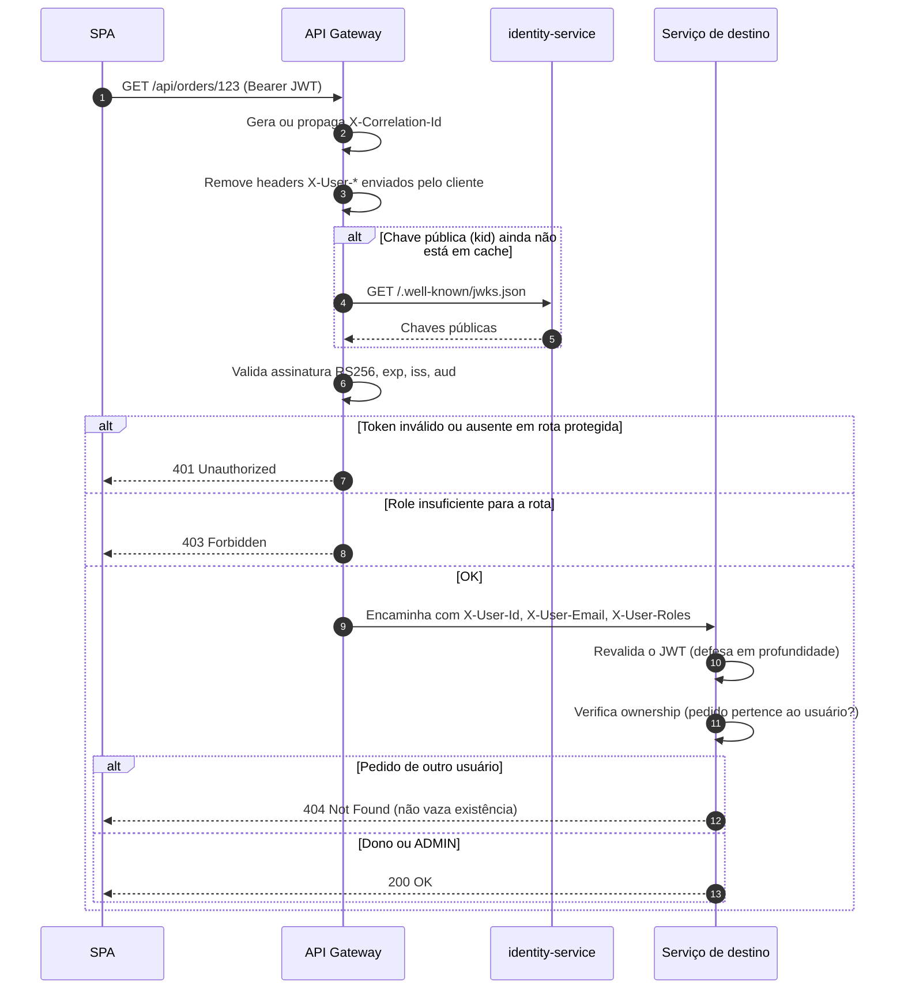
```mermaid
sequenceDiagram
    autonumber
    participant S as SPA
    participant G as API Gateway
    participant I as identity-service
    participant X as Serviço de destino

    S->>G: GET /api/orders/123 (Bearer JWT)
    G->>G: Gera ou propaga X-Correlation-Id
    G->>G: Remove headers X-User-* enviados pelo cliente
    alt Chave pública (kid) ainda não está em cache
        G->>I: GET /.well-known/jwks.json
        I-->>G: Chaves públicas
    end
    G->>G: Valida assinatura RS256, exp, iss, aud
    alt Token inválido ou ausente em rota protegida
        G-->>S: 401 Unauthorized
    else Role insuficiente para a rota
        G-->>S: 403 Forbidden
    else OK
        G->>X: Encaminha com X-User-Id, X-User-Email, X-User-Roles
        X->>X: Revalida o JWT (defesa em profundidade)
        X->>X: Verifica ownership (pedido pertence ao usuário?)
        alt Pedido de outro usuário
            X-->>S: 404 Not Found (não vaza existência)
        else Dono ou ADMIN
            X-->>S: 200 OK
        end
    end
```

### 6.3 Navegação no catálogo com cache 🟢

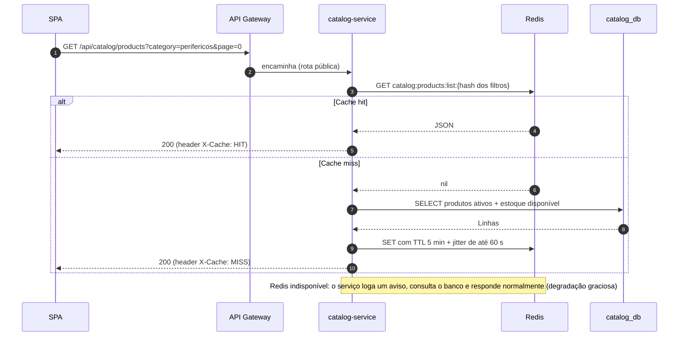
```mermaid
sequenceDiagram
    autonumber
    participant S as SPA
    participant G as API Gateway
    participant C as catalog-service
    participant R as Redis
    participant D as catalog_db

    S->>G: GET /api/catalog/products?category=perifericos&page=0
    G->>C: encaminha (rota pública)
    C->>R: GET catalog:products:list:{hash dos filtros}
    alt Cache hit
        R-->>C: JSON
        C-->>S: 200 (header X-Cache: HIT)
    else Cache miss
        R-->>C: nil
        C->>D: SELECT produtos ativos + estoque disponível
        D-->>C: Linhas
        C->>R: SET com TTL 5 min + jitter de até 60 s
        C-->>S: 200 (header X-Cache: MISS)
    end

    Note over C,R: Redis indisponível: o serviço loga um aviso, consulta o banco e responde normalmente (degradação graciosa)
```

Chaves usadas: `catalog:categories:all` (TTL 30 min), `catalog:product:{id}` (TTL 10 min) e `catalog:products:list:{hash}` (TTL 5 min).

### 6.4 Admin altera preço: auditoria e invalidação de cache 🟢

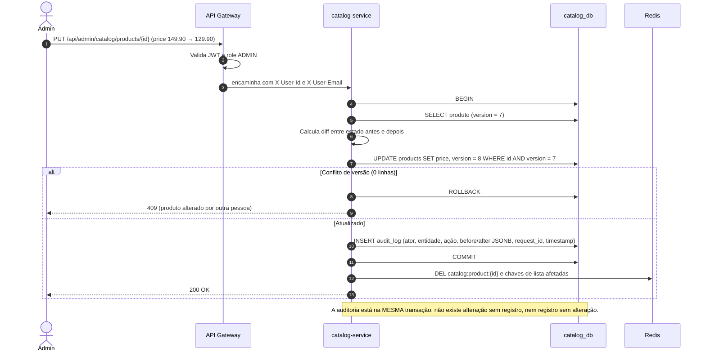
```mermaid
sequenceDiagram
    autonumber
    actor A as Admin
    participant G as API Gateway
    participant C as catalog-service
    participant D as catalog_db
    participant R as Redis

    A->>G: PUT /api/admin/catalog/products/{id} (price 149.90 → 129.90)
    G->>G: Valida JWT e role ADMIN
    G->>C: encaminha com X-User-Id e X-User-Email
    C->>D: BEGIN
    C->>D: SELECT produto (version = 7)
    C->>C: Calcula diff entre estado antes e depois
    C->>D: UPDATE products SET price, version = 8 WHERE id AND version = 7
    alt Conflito de versão (0 linhas)
        C->>D: ROLLBACK
        C-->>A: 409 (produto alterado por outra pessoa)
    else Atualizado
        C->>D: INSERT audit_log (ator, entidade, ação, before/after JSONB, request_id, timestamp)
        C->>D: COMMIT
        C->>R: DEL catalog:product:{id} e chaves de lista afetadas
        C-->>A: 200 OK
    end
    Note over C,D: A auditoria está na MESMA transação: não existe alteração sem registro, nem registro sem alteração.
```

Exemplo de registro de auditoria:

```json
{
  "entityType": "Product",
  "entityId": "0192f100-0001-7000-8000-000000000001",
  "action": "UPDATE",
  "actorId": "0192f1a0-0000-7000-8000-00000000ad01",
  "actorEmail": "admin@shopflow.dev",
  "changes": { "price": { "before": "149.90", "after": "129.90" } },
  "requestId": "c6e1f7a0-4b9a-4b73-9d0e-0c7f4d9a1b22",
  "occurredAt": "2026-10-05T13:58:02Z"
}
```

Como o preço do item do pedido é copiado no checkout, mudar o preço **não altera pedidos existentes**.

### 6.5 Carrinho 🟢

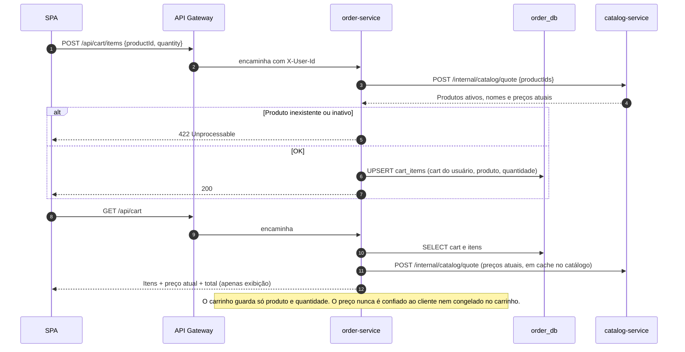
```mermaid
sequenceDiagram
    autonumber
    participant S as SPA
    participant G as API Gateway
    participant O as order-service
    participant D as order_db
    participant C as catalog-service

    S->>G: POST /api/cart/items {productId, quantity}
    G->>O: encaminha com X-User-Id
    O->>C: POST /internal/catalog/quote {productIds}
    C-->>O: Produtos ativos, nomes e preços atuais
    alt Produto inexistente ou inativo
        O-->>S: 422 Unprocessable
    else OK
        O->>D: UPSERT cart_items (cart do usuário, produto, quantidade)
        O-->>S: 200
    end

    S->>G: GET /api/cart
    G->>O: encaminha
    O->>D: SELECT cart e itens
    O->>C: POST /internal/catalog/quote (preços atuais, em cache no catálogo)
    O-->>S: Itens + preço atual + total (apenas exibição)
    Note over O: O carrinho guarda só produto e quantidade. O preço nunca é confiado ao cliente nem congelado no carrinho.
```

### 6.6 Checkout: parte síncrona 🟢

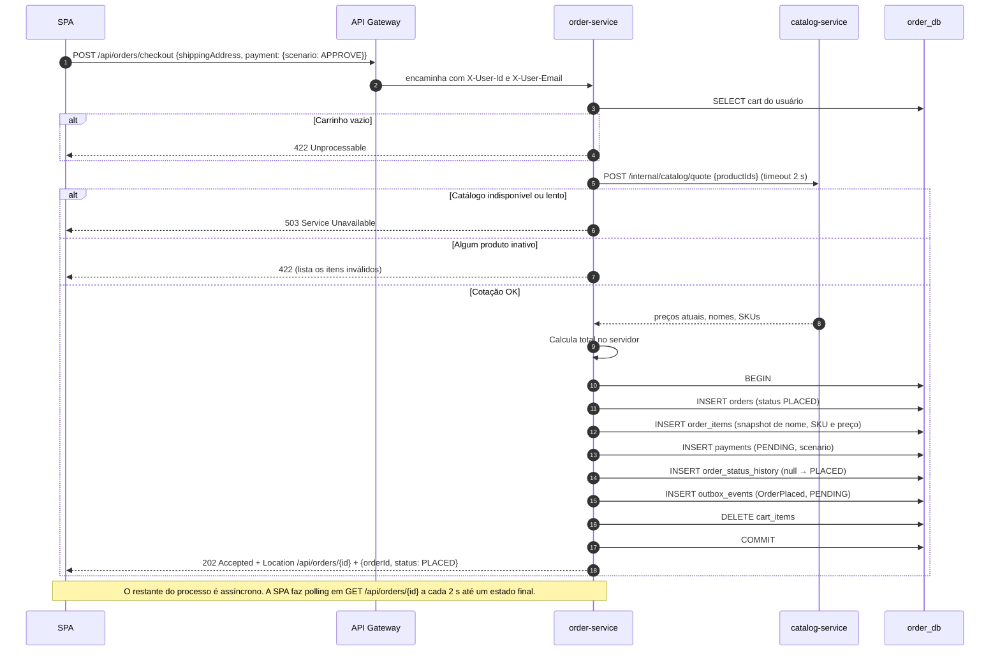
```mermaid
sequenceDiagram
    autonumber
    participant S as SPA
    participant G as API Gateway
    participant O as order-service
    participant C as catalog-service
    participant D as order_db

    S->>G: POST /api/orders/checkout {shippingAddress, payment: {scenario: APPROVE}}
    G->>O: encaminha com X-User-Id e X-User-Email
    O->>D: SELECT cart do usuário
    alt Carrinho vazio
        O-->>S: 422 Unprocessable
    end
    O->>C: POST /internal/catalog/quote {productIds} (timeout 2 s)
    alt Catálogo indisponível ou lento
        O-->>S: 503 Service Unavailable
    else Algum produto inativo
        O-->>S: 422 (lista os itens inválidos)
    else Cotação OK
        C-->>O: preços atuais, nomes, SKUs
        O->>O: Calcula total no servidor
        O->>D: BEGIN
        O->>D: INSERT orders (status PLACED)
        O->>D: INSERT order_items (snapshot de nome, SKU e preço)
        O->>D: INSERT payments (PENDING, scenario)
        O->>D: INSERT order_status_history (null → PLACED)
        O->>D: INSERT outbox_events (OrderPlaced, PENDING)
        O->>D: DELETE cart_items
        O->>D: COMMIT
        O-->>S: 202 Accepted + Location /api/orders/{id} + {orderId, status: PLACED}
    end
    Note over S,O: O restante do processo é assíncrono. A SPA faz polling em GET /api/orders/{id} a cada 2 s até um estado final.
```

### 6.7 Publicador da Outbox 🟢

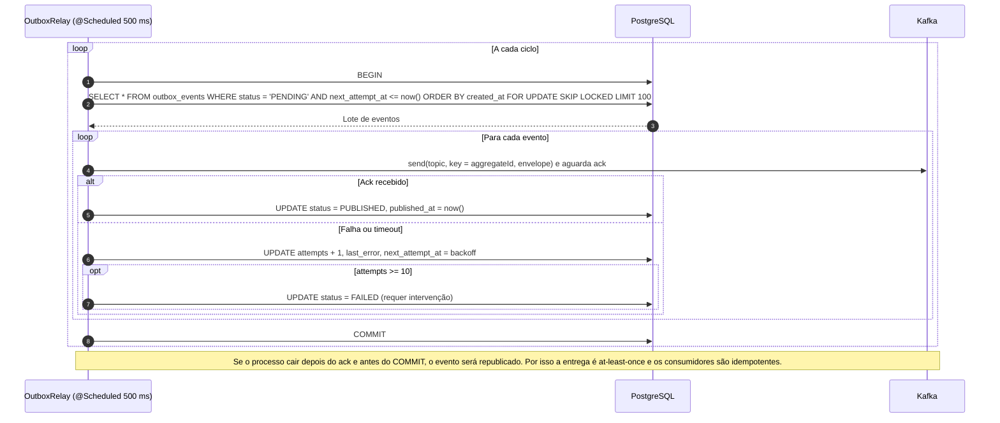
```mermaid
sequenceDiagram
    autonumber
    participant R as OutboxRelay (@Scheduled 500 ms)
    participant D as PostgreSQL
    participant K as Kafka

    loop A cada ciclo
        R->>D: BEGIN
        R->>D: SELECT * FROM outbox_events WHERE status = 'PENDING' AND next_attempt_at <= now() ORDER BY created_at FOR UPDATE SKIP LOCKED LIMIT 100
        D-->>R: Lote de eventos
        loop Para cada evento
            R->>K: send(topic, key = aggregateId, envelope) e aguarda ack
            alt Ack recebido
                R->>D: UPDATE status = PUBLISHED, published_at = now()
            else Falha ou timeout
                R->>D: UPDATE attempts + 1, last_error, next_attempt_at = backoff
                opt attempts >= 10
                    R->>D: UPDATE status = FAILED (requer intervenção)
                end
            end
        end
        R->>D: COMMIT
    end

    Note over R,K: Se o processo cair depois do ack e antes do COMMIT, o evento será republicado. Por isso a entrega é at-least-once e os consumidores são idempotentes.
```

Várias instâncias do mesmo serviço podem rodar o relay ao mesmo tempo: `SKIP LOCKED` faz cada uma pegar linhas diferentes.

### 6.8 Reserva de estoque (consumidor idempotente) 🟢

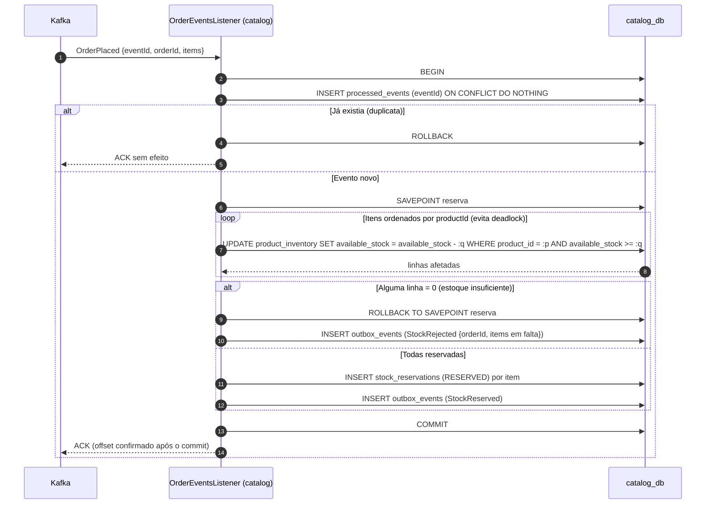
```mermaid
sequenceDiagram
    autonumber
    participant K as Kafka
    participant L as OrderEventsListener (catalog)
    participant D as catalog_db

    K->>L: OrderPlaced {eventId, orderId, items}
    L->>D: BEGIN
    L->>D: INSERT processed_events (eventId) ON CONFLICT DO NOTHING
    alt Já existia (duplicata)
        L->>D: ROLLBACK
        L-->>K: ACK sem efeito
    else Evento novo
        L->>D: SAVEPOINT reserva
        loop Itens ordenados por productId (evita deadlock)
            L->>D: UPDATE product_inventory SET available_stock = available_stock - :q WHERE product_id = :p AND available_stock >= :q
            D-->>L: linhas afetadas
        end
        alt Alguma linha = 0 (estoque insuficiente)
            L->>D: ROLLBACK TO SAVEPOINT reserva
            L->>D: INSERT outbox_events (StockRejected {orderId, items em falta})
        else Todas reservadas
            L->>D: INSERT stock_reservations (RESERVED) por item
            L->>D: INSERT outbox_events (StockReserved)
        end
        L->>D: COMMIT
        L-->>K: ACK (offset confirmado após o commit)
    end
```

A defesa contra oversell é dupla: `UPDATE ... WHERE available_stock >= :q` (atômico, sem ler antes de escrever) e `CHECK (available_stock >= 0)` na tabela.

### 6.9 Pagamento simulado e compensação 🟢

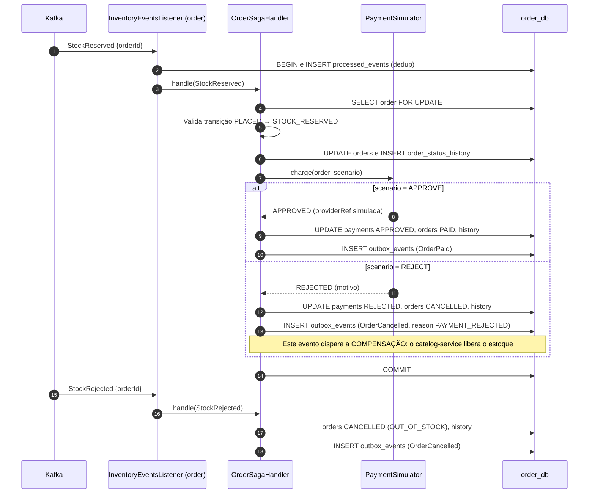
```mermaid
sequenceDiagram
    autonumber
    participant K as Kafka
    participant L as InventoryEventsListener (order)
    participant O as OrderSagaHandler
    participant P as PaymentSimulator
    participant D as order_db

    K->>L: StockReserved {orderId}
    L->>D: BEGIN e INSERT processed_events (dedup)
    L->>O: handle(StockReserved)
    O->>D: SELECT order FOR UPDATE
    O->>O: Valida transição PLACED → STOCK_RESERVED
    O->>D: UPDATE orders e INSERT order_status_history
    O->>P: charge(order, scenario)
    alt scenario = APPROVE
        P-->>O: APPROVED (providerRef simulada)
        O->>D: UPDATE payments APPROVED, orders PAID, history
        O->>D: INSERT outbox_events (OrderPaid)
    else scenario = REJECT
        P-->>O: REJECTED (motivo)
        O->>D: UPDATE payments REJECTED, orders CANCELLED, history
        O->>D: INSERT outbox_events (OrderCancelled, reason PAYMENT_REJECTED)
        Note over O,D: Este evento dispara a COMPENSAÇÃO: o catalog-service libera o estoque
    end
    O->>D: COMMIT

    K->>L: StockRejected {orderId}
    L->>O: handle(StockRejected)
    O->>D: orders CANCELLED (OUT_OF_STOCK), history
    O->>D: INSERT outbox_events (OrderCancelled)
```

### 6.10 Entrega simulada 🟢

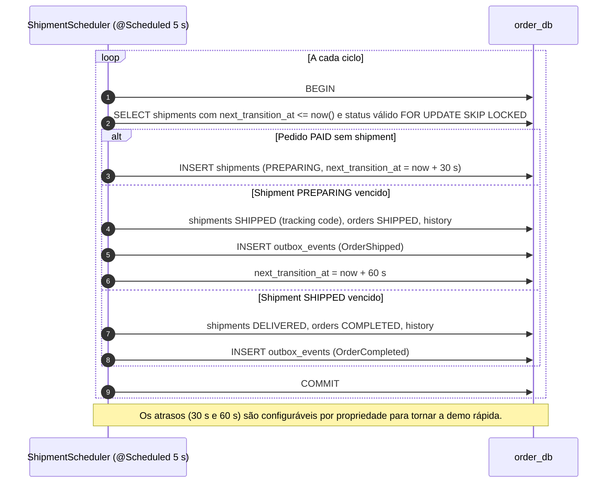
```mermaid
sequenceDiagram
    autonumber
    participant J as ShipmentScheduler (@Scheduled 5 s)
    participant D as order_db

    loop A cada ciclo
        J->>D: BEGIN
        J->>D: SELECT shipments com next_transition_at <= now() e status válido FOR UPDATE SKIP LOCKED
        alt Pedido PAID sem shipment
            J->>D: INSERT shipments (PREPARING, next_transition_at = now + 30 s)
        else Shipment PREPARING vencido
            J->>D: shipments SHIPPED (tracking code), orders SHIPPED, history
            J->>D: INSERT outbox_events (OrderShipped)
            J->>D: next_transition_at = now + 60 s
        else Shipment SHIPPED vencido
            J->>D: shipments DELIVERED, orders COMPLETED, history
            J->>D: INSERT outbox_events (OrderCompleted)
        end
        J->>D: COMMIT
    end
    Note over J,D: Os atrasos (30 s e 60 s) são configuráveis por propriedade para tornar a demo rápida.
```

### 6.11 Notificação por e-mail 🟢

```mermaid
sequenceDiagram
    autonumber
    participant K as Kafka
    participant N as notification-service
    participant D as notification_db
    participant M as SMTP (MailHog)

    K->>N: OrderPaid {orderId, customerEmail, items}
    N->>D: INSERT processed_events (dedup)
    N->>N: Renderiza template "pedido-confirmado"
    N->>M: Envia e-mail
    alt Enviado
        N->>D: INSERT email_log (SENT)
    else Falha no SMTP
        N->>D: INSERT email_log (FAILED, erro)
        N-->>K: Lança exceção: retry com backoff e depois DLT
    end
```

### 6.12 Webhook de pedido concluído 🟢

```mermaid
sequenceDiagram
    autonumber
    participant K as Kafka
    participant N as notification-service
    participant D as notification_db
    participant W as WebhookDispatcher (@Scheduled)
    participant P as Endpoint do parceiro

    K->>N: OrderCompleted {orderId, ...}
    N->>D: dedup + busca webhook_endpoints ativos inscritos em order.completed
    N->>D: INSERT webhook_deliveries (PENDING, attempts 0, next_attempt_at now) por endpoint

    loop Dispatcher
        W->>D: SELECT PENDING vencidos FOR UPDATE SKIP LOCKED LIMIT 50
        W->>W: body = JSON, ts = now
        W->>W: signature = HMAC-SHA256(secret, ts + "." + body)
        W->>P: POST url com X-ShopFlow-Event, X-ShopFlow-Delivery, X-ShopFlow-Timestamp, X-ShopFlow-Signature (timeout 5 s)
        alt 2xx
            W->>D: status = DELIVERED, last_status_code
        else 4xx, 5xx ou timeout
            alt attempts < 5
                W->>D: attempts + 1, next_attempt_at = 10 s, 30 s, 2 min, 10 min, 1 h
            else esgotado
                W->>D: status = DEAD (admin pode reenviar)
            end
        end
    end
```

Exemplo de payload entregue:

```json
{
  "id": "0192f1c8-aa10-7a00-9c00-000000000001",
  "type": "order.completed",
  "createdAt": "2026-10-05T14:05:44Z",
  "data": {
    "orderId": "0192f1c2-7d39-7b0f-8e11-a2c4d5e6f701",
    "customerEmail": "customer@shopflow.dev",
    "totalAmount": "349.80",
    "currency": "BRL",
    "items": [{ "sku": "KB-MECH-01", "quantity": 2, "unitPrice": "149.90" }],
    "trackingCode": "SF123456789BR",
    "completedAt": "2026-10-05T14:05:43Z"
  }
}
```

O parceiro valida a assinatura recalculando o HMAC com o segredo compartilhado, rejeita timestamps com mais de 5 minutos (anti-replay) e usa `X-ShopFlow-Delivery` para deduplicar (a entrega é at-least-once).

### 6.13 Saga de ponta a ponta: do clique à notificação 🟢

A visão única de toda a compra: caminho feliz, incluindo estoque e notificação.

```mermaid
sequenceDiagram
    autonumber
    actor U as Cliente
    participant S as SPA
    participant G as Gateway
    participant O as order-service
    participant KO as Kafka order.events
    participant C as catalog-service
    participant KI as Kafka inventory.events
    participant N as notification-service
    participant M as SMTP
    participant W as Webhook parceiro

    rect rgb(230, 240, 255)
    Note over U,O: Fase 1: síncrona (dezenas de ms)
    U->>S: Clica em "Finalizar compra"
    S->>G: POST /api/orders/checkout
    G->>O: JWT validado
    O->>C: cotação de preços (REST)
    C-->>O: preços atuais
    O->>O: TX: order PLACED + itens + payment + outbox(OrderPlaced), limpa carrinho
    O-->>S: 202 Accepted {orderId}
    S->>S: Inicia polling GET /api/orders/{id}
    end

    rect rgb(255, 245, 225)
    Note over O,C: Fase 2: reserva de estoque (assíncrona)
    O->>KO: OutboxRelay publica OrderPlaced
    KO->>C: OrderPlaced
    C->>C: TX: dedup + UPDATE atômico do estoque + reserva + outbox(StockReserved)
    C->>KI: OutboxRelay publica StockReserved
    end

    rect rgb(232, 248, 232)
    Note over O,N: Fase 3: pagamento, confirmação e notificação
    KI->>O: StockReserved
    O->>O: TX: STOCK_RESERVED, pagamento simulado APPROVED, PAID, outbox(OrderPaid)
    O->>KO: OutboxRelay publica OrderPaid
    par Consumidores independentes
        KO->>C: OrderPaid: reserva CONFIRMED
    and
        KO->>N: OrderPaid
        N->>M: E-mail "Pedido confirmado"
    end
    S->>O: Polling vê status PAID e atualiza a tela
    end

    rect rgb(250, 235, 245)
    Note over O,W: Fase 4: entrega simulada e conclusão
    O->>O: ShipmentScheduler: SHIPPED e depois COMPLETED (outbox a cada passo)
    O->>KO: OrderShipped, OrderCompleted
    KO->>N: OrderShipped
    N->>M: E-mail "Pedido enviado"
    KO->>N: OrderCompleted
    N->>M: E-mail "Pedido entregue"
    N->>W: POST webhook order.completed assinado
    S->>O: Polling vê COMPLETED e para
    end
```

### 6.14 Cenários de falha

#### a) Kafka indisponível durante o checkout

```mermaid
sequenceDiagram
    autonumber
    participant S as SPA
    participant O as order-service
    participant D as order_db
    participant R as OutboxRelay
    participant K as Kafka

    S->>O: POST /checkout
    O->>D: TX: order + outbox(OrderPlaced PENDING)
    O-->>S: 202 Accepted (o cliente não percebe a falha)
    R->>K: send(OrderPlaced)
    K--xR: timeout (broker fora)
    R->>D: attempts 1, next_attempt_at = backoff
    Note over R,D: O evento fica PENDING. Nenhum pedido é perdido.
    K-->>K: Kafka volta
    R->>K: send(OrderPlaced)
    K-->>R: ack
    R->>D: PUBLISHED
    Note over S,O: O pedido continua em PLACED enquanto o Kafka está fora e avança quando voltar
```

#### b) Consumidor falha e mensagem envenenada

```mermaid
sequenceDiagram
    autonumber
    participant K as Kafka
    participant L as Listener
    participant DLT as Tópico .DLT
    actor Op as Operador

    K->>L: Mensagem
    L->>L: Handler lança exceção
    L->>L: Retry 1 (1 s)
    L->>L: Retry 2 (2 s)
    L->>L: Retry 3 (4 s)
    alt Erro transitório se resolveu
        L-->>K: ACK
    else Persistiu ou erro não recuperável
        L->>DLT: Publica com headers (exceção, tópico, partição, offset)
        L-->>K: ACK (a partição não fica bloqueada)
        Op->>DLT: Inspeciona via Kafka UI
        Op->>K: Reprocessa depois da correção
    end
```

#### c) Evento duplicado

```mermaid
sequenceDiagram
    autonumber
    participant K as Kafka
    participant L as Consumidor
    participant D as Banco

    K->>L: StockReserved (eventId = X)
    L->>D: TX: INSERT processed_events(X) + efeito
    D-->>L: COMMIT
    Note over K,L: Broker reentrega por causa de rebalance ou falha antes do offset commit
    K->>L: StockReserved (eventId = X)
    L->>D: INSERT processed_events(X) ON CONFLICT DO NOTHING
    D-->>L: 0 linhas
    L-->>K: ACK sem efeito colateral
```

#### d) Pagamento rejeitado e compensação

```mermaid
flowchart LR
    A["OrderPlaced"] --> B["Estoque reservado<br/>available_stock - q"]
    B --> C["StockReserved"]
    C --> D{"Pagamento simulado"}
    D -->|"APPROVED"| E["OrderPaid<br/>reserva CONFIRMED"]
    D -->|"REJECTED"| F["Order CANCELLED<br/>evento OrderCancelled"]
    F --> G["catalog: reserva RELEASED<br/>available_stock + q"]
    F --> H["notification: e-mail de cancelamento"]
```

#### e) Pedido preso (timeout da saga)

```mermaid
flowchart TB
    S["StuckOrderSweeper<br/>a cada 60 s"] --> Q["Pedidos em PLACED ou STOCK_RESERVED<br/>há mais de 5 min"]
    Q --> C["orders CANCELLED (reason TIMEOUT)<br/>+ outbox OrderCancelled"]
    C --> R["catalog libera qualquer reserva existente<br/>(liberar é idempotente e seguro se não houver reserva)"]
```

#### f) Webhook indisponível

Coberto em 6.12: retries com backoff crescente e estado `DEAD` com reenvio manual pelo admin. A falha do parceiro **nunca** bloqueia o pedido, o e-mail nem o consumo de eventos.

---

## 7. Máquinas de estado

### 7.1 Pedido

```mermaid
stateDiagram-v2
    [*] --> PLACED: checkout aceito
    PLACED --> STOCK_RESERVED: StockReserved
    PLACED --> CANCELLED: StockRejected ou timeout
    STOCK_RESERVED --> PAID: pagamento aprovado
    STOCK_RESERVED --> CANCELLED: pagamento rejeitado ou timeout
    PAID --> SHIPPED: ShipmentScheduler
    SHIPPED --> COMPLETED: ShipmentScheduler
    COMPLETED --> [*]
    CANCELLED --> [*]
```

Transições são validadas no domínio (`Order.transitionTo`). Estados finais são imutáveis. Todo evento aplicado a um pedido em estado incompatível vira exceção não recuperável e vai para a DLT.

### 7.2 Reserva de estoque

```mermaid
stateDiagram-v2
    [*] --> RESERVED: StockReserved
    RESERVED --> CONFIRMED: OrderPaid
    RESERVED --> RELEASED: OrderCancelled
    CONFIRMED --> [*]
    RELEASED --> [*]
```

### 7.3 Evento da Outbox

```mermaid
stateDiagram-v2
    [*] --> PENDING: gravado na transação de negócio
    PENDING --> PENDING: falha de publicação, attempts + 1
    PENDING --> PUBLISHED: ack do Kafka
    PENDING --> FAILED: attempts >= 10
    FAILED --> PENDING: reprocessamento manual
    PUBLISHED --> [*]: removido pelo cleaner após 7 dias
```

### 7.4 Entrega de webhook

```mermaid
stateDiagram-v2
    [*] --> PENDING
    PENDING --> DELIVERED: resposta 2xx
    PENDING --> PENDING: falha, backoff crescente
    PENDING --> DEAD: 5 tentativas esgotadas
    DEAD --> PENDING: reenvio pelo admin
    DELIVERED --> [*]
```

### 7.5 Refresh token

```mermaid
stateDiagram-v2
    [*] --> ACTIVE: emitido no login
    ACTIVE --> USED: rotação no refresh
    ACTIVE --> REVOKED: logout
    ACTIVE --> EXPIRED: expires_at vencido
    USED --> REVOKED: reuso detectado, revoga a família inteira
    REVOKED --> [*]
    EXPIRED --> [*]
```

### 7.6 Produto

```mermaid
stateDiagram-v2
    [*] --> ACTIVE: criado
    ACTIVE --> INACTIVE: admin inativa (soft delete)
    INACTIVE --> ACTIVE: admin reativa
```

---

## 8. Modelos de dados

Não há chaves estrangeiras entre bancos. Referências entre serviços (`user_id`, `product_id`, `order_id`) são **lógicas**. Chaves primárias são UUID v7 (ordenáveis por tempo).

### 8.1 identity_db

```mermaid
erDiagram
    USERS ||--o{ REFRESH_TOKENS : possui

    USERS {
        uuid id PK
        string email UK
        string password_hash
        string name
        string role
        string status
        timestamp created_at
    }
    REFRESH_TOKENS {
        uuid id PK
        uuid user_id FK
        string token_hash UK
        uuid family_id
        string status
        timestamp expires_at
        uuid replaced_by
        timestamp created_at
    }
```

### 8.2 catalog_db

```mermaid
erDiagram
    CATEGORIES ||--o{ PRODUCTS : agrupa
    PRODUCTS ||--|| PRODUCT_INVENTORY : tem
    PRODUCTS ||--o{ STOCK_RESERVATIONS : reservado_em

    CATEGORIES {
        uuid id PK
        string name
        string slug UK
        timestamp created_at
    }
    PRODUCTS {
        uuid id PK
        uuid category_id FK
        string sku UK
        string name
        string description
        decimal price
        string currency
        string status
        bigint version
        timestamp created_at
        timestamp updated_at
    }
    PRODUCT_INVENTORY {
        uuid product_id PK
        integer available_stock "CHECK maior ou igual a 0"
        timestamp updated_at
    }
    STOCK_RESERVATIONS {
        uuid id PK
        uuid order_id "UK junto com product_id"
        uuid product_id FK
        integer quantity
        string status
        timestamp created_at
        timestamp updated_at
    }
    AUDIT_LOG {
        uuid id PK
        string entity_type
        uuid entity_id
        string action
        uuid actor_id
        string actor_email
        jsonb changes
        uuid request_id
        timestamp occurred_at
    }
    OUTBOX_EVENTS {
        uuid id PK
        string aggregate_type
        uuid aggregate_id
        string event_type
        jsonb payload
        string status
        integer attempts
        timestamp next_attempt_at
        string last_error
        timestamp created_at
        timestamp published_at
    }
    PROCESSED_EVENTS {
        uuid event_id PK
        string consumer
        timestamp processed_at
    }
```

`AUDIT_LOG`, `OUTBOX_EVENTS` e `PROCESSED_EVENTS` são tabelas independentes (sem relação de chave estrangeira).

### 8.3 order_db

```mermaid
erDiagram
    CARTS ||--o{ CART_ITEMS : contem
    ORDERS ||--|{ ORDER_ITEMS : contem
    ORDERS ||--o{ ORDER_STATUS_HISTORY : registra
    ORDERS ||--|| PAYMENTS : cobrado_por
    ORDERS ||--o| SHIPMENTS : entregue_por

    CARTS {
        uuid id PK
        uuid user_id UK
        timestamp updated_at
    }
    CART_ITEMS {
        uuid id PK
        uuid cart_id FK
        uuid product_id "UK junto com cart_id"
        integer quantity
    }
    ORDERS {
        uuid id PK
        uuid user_id
        string customer_email
        string status
        decimal total_amount
        string currency
        jsonb shipping_address
        string cancel_reason
        bigint version
        timestamp created_at
        timestamp updated_at
    }
    ORDER_ITEMS {
        uuid id PK
        uuid order_id FK
        uuid product_id
        string sku
        string product_name
        integer quantity
        decimal unit_price
    }
    ORDER_STATUS_HISTORY {
        uuid id PK
        uuid order_id FK
        string from_status
        string to_status
        string reason
        string actor
        timestamp occurred_at
    }
    PAYMENTS {
        uuid id PK
        uuid order_id FK
        decimal amount
        string scenario
        string status
        string provider_ref
        string failure_reason
        timestamp created_at
    }
    SHIPMENTS {
        uuid id PK
        uuid order_id FK
        string status
        string tracking_code
        timestamp next_transition_at
        timestamp shipped_at
        timestamp delivered_at
    }
    OUTBOX_EVENTS {
        uuid id PK
        string event_type
        jsonb payload
        string status
        integer attempts
        timestamp next_attempt_at
    }
    PROCESSED_EVENTS {
        uuid event_id PK
        string consumer
        timestamp processed_at
    }
```

### 8.4 notification_db

```mermaid
erDiagram
    WEBHOOK_ENDPOINTS ||--o{ WEBHOOK_DELIVERIES : recebe

    WEBHOOK_ENDPOINTS {
        uuid id PK
        string url
        string secret
        string event_types
        boolean active
        uuid created_by
        timestamp created_at
    }
    WEBHOOK_DELIVERIES {
        uuid id PK
        uuid endpoint_id FK
        uuid event_id
        string event_type
        jsonb payload
        string status
        integer attempts
        timestamp next_attempt_at
        integer last_status_code
        string last_error
        timestamp created_at
    }
    EMAIL_LOG {
        uuid id PK
        uuid event_id
        uuid order_id
        string recipient
        string template
        string status
        string error
        timestamp sent_at
    }
    PROCESSED_EVENTS {
        uuid event_id PK
        string consumer
        timestamp processed_at
    }
```

O `secret` do webhook é armazenado cifrado (chave de aplicação por variável de ambiente).

---

## 9. Contratos de API

Todos os endpoints públicos passam pelo gateway. Documentação OpenAPI por serviço em `/swagger-ui.html` (ambiente local).

### 9.1 Tabela de rotas do gateway

| Rota externa                                    | Destino              | Autenticação                             |
| ----------------------------------------------- | -------------------- | ---------------------------------------- |
| `POST /api/auth/register`, `/login`, `/refresh` | identity-service     | Pública                                  |
| `POST /api/auth/logout`, `GET /api/auth/me`     | identity-service     | Qualquer usuário logado                  |
| `GET /api/catalog/**`                           | catalog-service      | Pública                                  |
| `/api/admin/catalog/**`                         | catalog-service      | `ADMIN`                                  |
| `/api/cart/**`, `/api/orders/**`                | order-service        | `CUSTOMER`                               |
| `/api/admin/orders/**`                          | order-service        | `ADMIN`                                  |
| `/api/admin/webhooks/**`                        | notification-service | `ADMIN`                                  |
| `/internal/**`                                  | (não roteado)        | Apenas rede interna e `X-Internal-Token` |

### 9.2 Endpoints principais

| Serviço           | Método e caminho                                     | Descrição                                                  | Resposta      |
| ----------------- | ---------------------------------------------------- | ---------------------------------------------------------- | ------------- |
| identity          | `POST /api/auth/register`                            | Cadastro                                                   | 201, 409, 422 |
| identity          | `POST /api/auth/login`                               | Login                                                      | 200, 401      |
| identity          | `POST /api/auth/refresh`                             | Rotação de tokens                                          | 200, 401      |
| catalog           | `GET /api/catalog/categories`                        | Lista categorias (cache)                                   | 200           |
| catalog           | `GET /api/catalog/products`                          | Lista paginada com `category`, `q`, `sort`, `page`, `size` | 200           |
| catalog           | `GET /api/catalog/products/{id}`                     | Detalhe                                                    | 200, 404      |
| catalog           | `POST/PUT /api/admin/catalog/products`               | Cria e edita (audita)                                      | 201, 200, 409 |
| catalog           | `PATCH /api/admin/catalog/products/{id}/stock`       | Ajusta estoque (audita)                                    | 200           |
| catalog           | `GET /api/admin/catalog/audit`                       | Consulta auditoria com filtros                             | 200           |
| order             | `GET/POST/PATCH/DELETE /api/cart/items`              | Gerencia carrinho                                          | 200           |
| order             | `POST /api/orders/checkout`                          | Cria pedido de forma assíncrona                            | 202, 422, 503 |
| order             | `GET /api/orders` e `/api/orders/{id}`               | Meus pedidos e detalhe com histórico                       | 200, 404      |
| order             | `GET /api/admin/orders`                              | Todos os pedidos (filtros por status e data)               | 200           |
| notification      | `CRUD /api/admin/webhooks`                           | Endpoints de webhook                                       | 200           |
| notification      | `GET /api/admin/webhooks/{id}/deliveries`            | Histórico de entregas                                      | 200           |
| notification      | `POST /api/admin/webhooks/deliveries/{id}/redeliver` | Reenvio manual                                             | 202           |
| catalog (interno) | `POST /internal/catalog/quote`                       | Cotação de preços por lista de produtos                    | 200           |

### 9.3 Formato de erro (RFC 9457 Problem Details)

```json
{
  "type": "https://shopflow.dev/problems/validation-error",
  "title": "Requisição inválida",
  "status": 422,
  "detail": "O carrinho está vazio.",
  "instance": "/api/orders/checkout",
  "correlationId": "c6e1f7a0-4b9a-4b73-9d0e-0c7f4d9a1b22"
}
```

Nunca há stack trace na resposta.

---

## 10. Implantação e CI/CD

### 10.1 Docker Compose: ambiente local

```mermaid
flowchart TB
    browser["Navegador"]

    subgraph app["Aplicação ShopFlow"]
        frontend["frontend<br/>React + Nginx<br/>:3000"]
        gateway["api-gateway<br/>Spring Cloud Gateway<br/>:8080"]
        identity["identity-service<br/>:8081"]
        catalog["catalog-service<br/>:8082"]
        order["order-service<br/>:8083"]
        notification["notification-service<br/>:8084"]
    end

    subgraph data["Dados e mensageria"]
        postgres[("PostgreSQL 16<br/>:5432")]
        redis[("Redis 7<br/>:6379")]
        kafka[["Kafka KRaft<br/>:9092"]]
        kafkaInit["kafka-init"]
    end

    subgraph tools["Ferramentas locais"]
        kafkaUi["Kafka UI<br/>:8090"]
        mailhog["MailHog<br/>:8025"]
        wiremock["WireMock<br/>:8089"]
    end

    subgraph optional["Perfis opcionais"]
        connect["Kafka Connect + Debezium<br/>:8083"]
        opensearch[("OpenSearch<br/>:9200")]
    end

    browser --> frontend --> gateway
    gateway --> identity
    gateway --> catalog
    gateway --> order
    gateway --> notification

    identity --> postgres
    catalog --> postgres
    order --> postgres
    notification --> postgres
    catalog --> redis

    order -.-> kafka
    catalog -.-> kafka
    kafka -.-> order
    kafka -.-> catalog
    kafka -.-> notification

    kafkaInit --> kafka
    kafkaUi --> kafka
    notification --> mailhog
    notification --> wiremock

    postgres -. "CDC profile" .-> connect
    connect -.-> kafka
    kafka -. "search-indexer futuro" .-> opensearch

    classDef app fill:#438dd5,stroke:#2e6295,color:#fff
    classDef data fill:#2f6f5e,stroke:#1f4a3f,color:#fff
    classDef tool fill:#8a8a8a,stroke:#5c5c5c,color:#fff
    classDef optional fill:#7d3c98,stroke:#512e5f,color:#fff

    class frontend,gateway,identity,catalog,order,notification app
    class postgres,redis,kafka,kafkaInit data
    class kafkaUi,mailhog,wiremock tool
    class connect,opensearch optional
```

O Compose padrão sobe a infraestrutura principal. Debezium e OpenSearch são
ativados separadamente pelos profiles `cdc` e `search`. Os microsserviços da
aplicação serão adicionados ao Compose conforme as fases do roadmap forem
implementadas.

### 10.2 Pipeline de CI 🟢

```mermaid
flowchart LR
    push["Push ou Pull Request"] --> build["Gradle build<br/>compila todos os módulos"]
    build --> unit["Testes unitários<br/>JUnit 5 + ArchUnit"]
    unit --> integ["Testes de integração<br/>Testcontainers: Postgres, Kafka, Redis"]
    integ --> front["Frontend<br/>lint, testes, build"]
    front --> img["Build das imagens Docker"]
    img --> smoke["Smoke test<br/>docker compose up + cenário de compra"]
    smoke --> pub{"Branch main?"}
    pub -->|"sim"| ghcr["Publica imagens no GHCR"]
    pub -->|"não"| fim["Fim"]
```

### 10.3 Serviços opcionais de plataforma

#### Debezium

Debezium será executado pelo Kafka Connect e capturará alterações do PostgreSQL
usando logical replication.

```mermaid
flowchart LR
    PG[("PostgreSQL<br/>logical replication")]
    DBZ["Debezium PostgreSQL Connector"]
    KC["Kafka Connect"]
    K[["Kafka"]]
    IDX["Indexador"]
    OS[("OpenSearch")]

    PG --> DBZ --> KC --> K
    K --> IDX --> OS
```

Debezium não substitui automaticamente a Transactional Outbox. O Outbox continua
sendo o padrão principal para eventos de domínio. Debezium poderá ser usado para:

- alimentar índices de busca;
- construir projeções de leitura;
- integrar dados com plataformas analíticas;
- reduzir polling em cenários de alto volume.

#### Busca inteligente

A busca pública continuará tendo o PostgreSQL como fallback. O OpenSearch será
adicionado apenas para funcionalidades que exigem:

- tolerância a erros de digitação;
- autocomplete;
- busca por relevância;
- sinônimos;
- stemming;
- filtros e agregações complexas.

O catálogo no PostgreSQL permanece como fonte de verdade. A indexação é
eventualmente consistente e pode ser reconstruída a partir dos dados persistidos.

#### Kong Gateway

Kong Gateway é uma alternativa gratuita para o API Gateway, especialmente útil
para rate limiting, plugins, métricas e gerenciamento de tráfego. A decisão atual
é manter o Spring Cloud Gateway, pois ele já está alinhado à implementação Java e
aos testes do projeto.

Kong poderá ser introduzido posteriormente como gateway de borda, mantendo as
regras de negócio e autorização nos serviços.

```

## 11. Planejado, sem código

Os itens desta seção estão documentados, mas não fazem parte da implementação
atual. Eles não devem ser classificados como disponíveis apenas porque possuem
imagens Docker no ambiente local.

### 11.1 Observabilidade

```mermaid
flowchart LR
    services["Microsserviços"]
    gateway["API Gateway"]

    services -->|"logs JSON"| loki[("Loki")]
    services -->|"métricas"| prometheus[("Prometheus")]
    services -->|"OTLP traces"| collector["OpenTelemetry Collector"]
    gateway -->|"logs, métricas e traces"| collector

    collector --> tempo[("Tempo")]
    prometheus --> grafana["Grafana"]
    loki --> grafana
    tempo --> grafana

    grafana --> alerts["Alertas e dashboards"]
```

Planejado:

- logs estruturados em JSON;
- correlação por `correlationId` e `traceparent`;
- métricas Micrometer e Prometheus;
- traces distribuídos via OpenTelemetry;
- dashboards Grafana;
- logs centralizados no Loki;
- traces armazenados no Tempo;
- alertas para consumer lag, DLT, erro de checkout e latência.

### 11.2 Segurança avançada

- rate limiting por IP, usuário e rota;
- blacklist temporária de IPs usando Redis;
- blind login;
- autenticação 2FA por TOTP;
- rotação automatizada das chaves JWT;
- mTLS entre serviços.

### 11.3 Idempotência de requisições

O checkout poderá aceitar o header `Idempotency-Key`. A chave será armazenada
no `order_db`, associada ao usuário e ao resultado da requisição.

A unicidade será garantida por:

```text
(user_id, idempotency_key)
```

Requisições repetidas retornarão o mesmo `orderId`, sem criar outro pedido.

### 11.4 Resiliência

- Circuit Breaker com Resilience4j;
- Bulkhead para chamadas ao catálogo;
- retry apenas para erros transitórios;
- timeouts explícitos;
- fallback para operações de leitura;
- testes de falhas entre serviços.

### 11.5 CDC e busca inteligente

```mermaid
flowchart LR
    catalogDb[("catalog_db<br/>PostgreSQL")]
    debezium["Debezium PostgreSQL Connector"]
    connect["Kafka Connect"]
    kafka[["Kafka"]]
    indexer["search-indexer<br/>planejado"]
    search[("OpenSearch")]
    api["catalog-service"]

    catalogDb --> debezium --> connect --> kafka
    kafka --> indexer --> search
    api --> search
    api -. "fallback" .-> catalogDb
```

Debezium será executado em container e é gratuito para uso local. Ele captura
alterações do PostgreSQL por logical replication.

Debezium não substitui automaticamente a Transactional Outbox. A Outbox continua
sendo responsável pelos eventos de domínio. O CDC será utilizado principalmente
para projeções de leitura e indexação.

O OpenSearch será opcional e destinado a:

- fuzzy search;
- autocomplete;
- tolerância a erros de digitação;
- relevância;
- stemming;
- sinônimos;
- filtros e agregações.

O PostgreSQL permanece como fonte de verdade. A busca em OpenSearch possui
consistência eventual e deve permitir reindexação completa.

### 11.6 Kong Gateway

```mermaid
flowchart LR
    client["Cliente"] --> kong["Kong Gateway<br/>alternativa futura"]
    kong --> spring["Spring Cloud Gateway<br/>opção atual"]
    spring --> services["Microsserviços"]
```

O gateway atual é o Spring Cloud Gateway. Kong permanece como alternativa para
um cenário futuro com plugins de rate limiting, autenticação, métricas e
gerenciamento de tráfego.

Não serão utilizados dois gateways simultaneamente no ambiente principal.

### Status dos componentes planejados

| Componente    | Status | Observação                          |
| ------------- | ------ | ----------------------------------- |
| OpenTelemetry | 🔵     | Planejado                           |
| Prometheus    | 🔵     | Planejado                           |
| Grafana       | 🔵     | Planejado                           |
| Loki          | 🔵     | Planejado                           |
| Tempo         | 🔵     | Planejado                           |
| Debezium      | 🔵     | Container opcional para CDC         |
| OpenSearch    | 🔵     | Container opcional para busca       |
| Kong          | 🔵     | Alternativa ao Spring Cloud Gateway |
