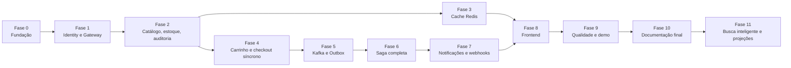

# Roadmap de Implementação do ShopFlow

Regra do roadmap: **cada fase termina com algo executável e demonstrável.** Nada de "quase pronto" acumulado. Itens 🔵 do [REQUIREMENTS.md](REQUIREMENTS.md#6-requisitos-planejados-sem-código) ficam de fora do código e só entram como documentação.

## Dependência entre fases



## Fase 0: Fundação

- [ ] Repositório com Gradle multi-módulo (`services/*`, `libs/*`)
- [ ] Docker Compose com PostgreSQL (4 bancos), Redis e Kafka (KRaft)
- [ ] `kafka-init` criando `order.events`, `inventory.events` e as DLTs
- [ ] Flyway configurado por serviço
- [ ] Actuator (liveness e readiness) e OpenAPI em cada serviço
- [ ] Tratamento global de erros (RFC 9457) em módulo compartilhado
- [ ] Pipeline de CI: build e testes
- [ ] `libs/event-contracts` com o envelope de eventos

**Entregável:** `docker compose up` sobe a infraestrutura e cada serviço responde `/actuator/health`.

## Fase 1: Identity e Gateway

- [ ] Cadastro, login, refresh com rotação e detecção de reuso, logout, `/me`
- [ ] Argon2id, JWT RS256, JWKS
- [ ] Gateway com validação de JWT, roles, CORS, `X-Correlation-Id` e sanitização de headers
- [ ] Testes de autorização por rota (401 e 403)

**Entregável:** é possível se cadastrar, entrar e acessar uma rota protegida pelo gateway. Diagramas 6.1 e 6.2 refletem o comportamento real.

## Fase 2: Catálogo, estoque e auditoria

- [ ] Categorias e produtos (CRUD admin, soft delete)
- [ ] Listagem pública paginada com filtros
- [ ] `product_inventory` com `CHECK (available_stock >= 0)`
- [ ] Controle otimista de versão nos produtos
- [ ] `audit_log` gravado na mesma transação da alteração e endpoint de consulta
- [ ] Endpoint interno de cotação de preços
- [ ] Seeds de categorias, produtos e estoque

**Entregável:** admin cadastra produtos, altera preço e vê o registro de auditoria com antes e depois.

## Fase 3: Cache Redis

- [ ] Cache-aside de categorias, produto e listagens, com TTL e jitter
- [ ] Invalidação na escrita
- [ ] Header `X-Cache` (`HIT` ou `MISS`) para demonstração
- [ ] Degradação graciosa com Redis fora do ar
- [ ] Testes com Testcontainers, incluindo Redis parado

**Entregável:** segunda leitura idêntica vem do Redis. Editar um produto invalida o cache. Diagrama 6.3 confere.

## Fase 4: Carrinho e checkout síncrono

- [ ] Carrinho persistido (adicionar, alterar, remover, ver, esvaziar)
- [ ] Cliente REST de cotação com timeout de 2 s
- [ ] Checkout: pedido, itens com snapshot, pagamento pendente e histórico de status na mesma transação
- [ ] Máquina de estados no domínio, com testes de todas as transições inválidas
- [ ] Ownership (cliente não acessa pedido alheio)
- [ ] Endpoint de consulta de pedido e lista

**Entregável:** compra criada e consultada via Swagger, ainda sem mensageria (pedido fica em `PLACED`).

## Fase 5: Kafka e Transactional Outbox

- [ ] `libs/outbox-starter`: `OutboxWriter`, `OutboxRelay` (`SKIP LOCKED`, lote, backoff), `OutboxCleaner`
- [ ] Checkout grava `OrderPlaced` na Outbox (sem publicar direto)
- [ ] Consumidor de `OrderPlaced` no catalog com `IdempotencyGuard`
- [ ] Reserva atômica de estoque (all-or-nothing, ordem por `productId`, savepoint)
- [ ] `StockReserved` e `StockRejected` publicados pela Outbox do catalog
- [ ] Erros do consumidor: retry com backoff e DLT
- [ ] Testes: Kafka indisponível, evento duplicado, dois relays, mensagem inválida

**Cenário obrigatório:**

```text
Estoque: 1 | Compras simultâneas: 10
Resultado: 1 StockReserved, 9 StockRejected, estoque final 0
```

**Entregável:** o pedido dispara reserva de estoque de forma assíncrona e confiável. Diagramas 6.7 e 6.8 e cenários 6.14a a 6.14c reproduzidos em teste.

## Fase 6: Saga completa

- [ ] `order-service` consome `StockReserved` e `StockRejected`
- [ ] Pagamento simulado com cenários `APPROVE` e `REJECT`
- [ ] `OrderPaid` e `OrderCancelled` via Outbox
- [ ] Catalog: confirmar reserva em `OrderPaid`, liberar em `OrderCancelled` (compensação)
- [ ] `ShipmentScheduler` (`PAID → SHIPPED → COMPLETED`, atrasos configuráveis)
- [ ] `StuckOrderSweeper` (timeout de 5 min)
- [ ] Teste E2E do caminho feliz, de estoque insuficiente, de pagamento rejeitado e de timeout

**Entregável:** o pedido percorre todos os estados sozinho. Diagrama 6.13 confere.

## Fase 7: Notificações e webhooks

- [ ] `notification-service` consumindo `order.events`
- [ ] E-mails por template (MailHog) e `email_log`
- [ ] Endpoints de webhook (CRUD admin), com segredo cifrado
- [ ] Dispatcher com HMAC-SHA256, timestamp, retry com backoff e estado `DEAD`
- [ ] Reenvio manual e histórico de entregas
- [ ] WireMock como parceiro, com stubs de sucesso e falha

**Entregável:** ao concluir o pedido, e-mail chega ao MailHog e o webhook assinado chega ao WireMock. Cenário 8 do roteiro de demonstração funciona.

## Fase 8: Frontend

- [ ] Base: roteamento, cliente HTTP com renovação silenciosa de sessão
- [ ] Loja: listagem com filtros, detalhe, carrinho, checkout com seletor de cenário de pagamento
- [ ] Meus pedidos com linha do tempo e polling a cada 2 s
- [ ] Painel admin: produtos, categorias, estoque, pedidos, auditoria e webhooks
- [ ] Dockerfile com Nginx e proxy de `/api`

**Entregável:** toda a jornada é possível pela interface, sem uso de Swagger.

## Fase 9: Qualidade e demonstração

- [ ] Testes de concorrência e de idempotência consolidados
- [ ] ArchUnit em todos os serviços
- [ ] Gate de cobertura do domínio (80%)
- [ ] Varredura de dependências no CI
- [ ] Smoke test no CI: `compose up` e cenário de compra
- [ ] Teste de carga leve (k6) para catálogo e checkout
- [ ] Seeds e roteiro de demonstração conferidos ponta a ponta

**Entregável:** o CI fica verde e a demo roda do zero em uma máquina limpa.

## Fase 10: Documentação final

- [ ] Diagramas conferidos contra o comportamento real (ajustar o que divergir)
- [ ] ADRs revisados. Quebrar em `docs/adr/` se preferir arquivos individuais
- [ ] Seção 11 do ARCHITECTURE.md revisada (itens 🔵)
- [ ] README com GIF ou capturas da demo
- [ ] Vídeo curto ou roteiro de apresentação da arquitetura

**Entregável:** repositório pronto para ser apresentado como evidência técnica.

## Fase 11: Busca inteligente e projeções

- [ ] Executar Kafka Connect com Debezium em ambiente local
- [ ] Configurar PostgreSQL com logical replication
- [ ] Criar conector Debezium para `catalog_db`
- [ ] Criar indexador de produtos
- [ ] Executar OpenSearch com profile opcional
- [ ] Implementar busca fuzzy e autocomplete
- [ ] Implementar reindexação completa do catálogo
- [ ] Definir fallback para busca nativa do PostgreSQL
- [ ] Testar atraso e recuperação da indexação

**Entregável:** a busca inteligente funciona com OpenSearch, mas o PostgreSQL
continua sendo a fonte de verdade.

### Decisão sobre novas tecnologias

| Tecnologia    | Decisão                          | Motivo                                                                            |
| ------------- | -------------------------------- | --------------------------------------------------------------------------------- |
| Redis         | Adotado                          | Cache-aside e futuras funcionalidades de rate limiting                            |
| Debezium      | Planejado, executável localmente | CDC e projeções de leitura                                                        |
| OpenSearch    | Planejado e opcional             | Busca fuzzy e relevância                                                          |
| Elasticsearch | Não adotado inicialmente         | OpenSearch oferece alternativa compatível e mais adequada ao requisito de licença |
| Kong          | Alternativa documentada          | Gateway funcional, gratuito e baseado em plugins                                  |

## Definição de pronto da versão 1.0

- [ ] Cliente navega, monta carrinho e finaliza compra pela interface
- [ ] Preço sempre calculado no servidor e copiado para o item
- [ ] Estoque reservado atomicamente e devolvido em cancelamento
- [ ] Pedido e evento confirmados juntos (Outbox), sem evento perdido com Kafka fora
- [ ] Eventos duplicados não duplicam efeitos
- [ ] Mensagens inválidas vão para a DLT sem bloquear
- [ ] Alteração de preço gera auditoria com antes e depois
- [ ] Cache reduz leituras no banco e não é fonte de verdade
- [ ] E-mails e webhooks assinados são entregues, com retry
- [ ] Testes de integração com Testcontainers passam no CI
- [ ] `docker compose up` sobe tudo com seeds
- [ ] Documentação explica decisões, fluxos e o que foi apenas planejado

## Critério para incluir qualquer tecnologia nova

1. Qual problema ela resolve?
2. Esse problema existe hoje no projeto?
3. PostgreSQL, Spring ou Kafka já resolvem?
4. Qual o custo de operação e manutenção?
5. Como será testada?
6. Como a decisão será explicada em uma entrevista?

Sem resposta clara, a tecnologia fica como item 🔵 na documentação.
