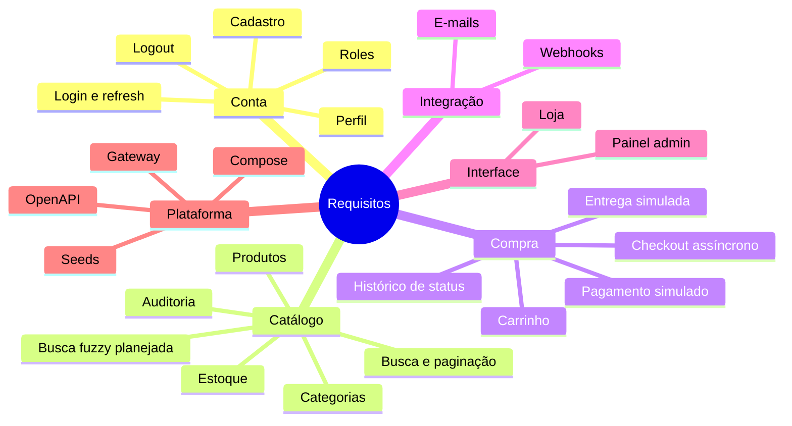
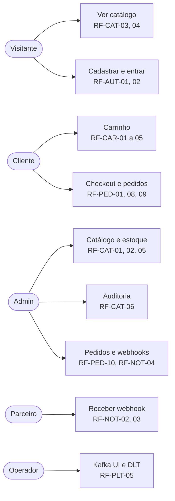
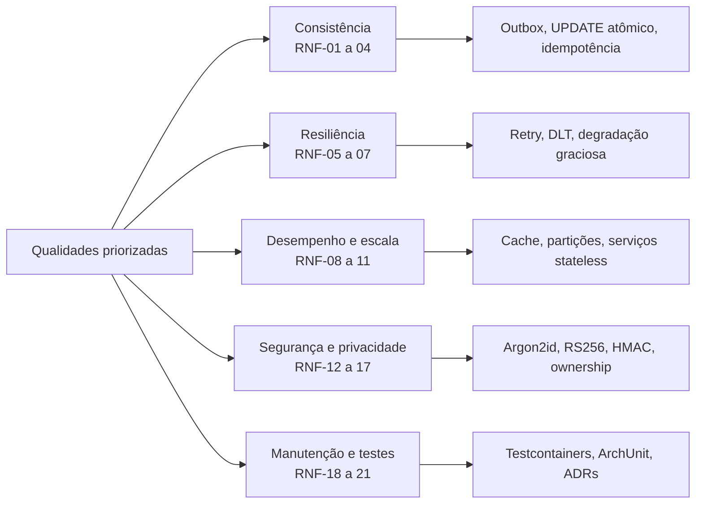
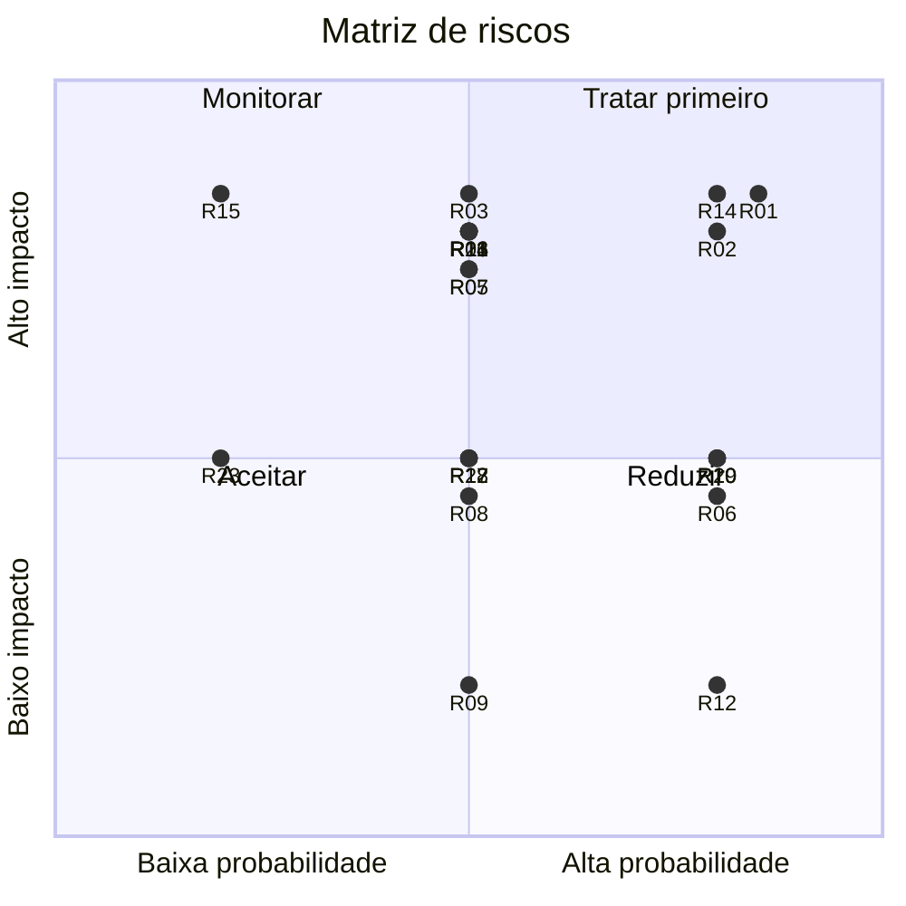

# Requisitos do ShopFlow

Este documento define **o que** o ShopFlow faz e com quais qualidades. O **como** está em [ARCHITECTURE.md](ARCHITECTURE.md).

| Marca           | Significado                         |
| --------------- | ----------------------------------- |
| 🟢 Implementado | Será entregue como código           |
| 🔵 Planejado    | Projetado e documentado, sem código |

---

## Sumário

1. [Escopo](#1-escopo)
2. [Atores](#2-atores)
3. [Requisitos funcionais](#3-requisitos-funcionais)
4. [Regras de negócio](#4-regras-de-negócio)
5. [Requisitos não funcionais](#5-requisitos-não-funcionais)
6. [Requisitos planejados, sem código](#6-requisitos-planejados-sem-código)
7. [Riscos e mitigações](#7-riscos-e-mitigações)
8. [Premissas e restrições](#8-premissas-e-restrições)
9. [Matriz de rastreabilidade](#9-matriz-de-rastreabilidade)
10. [Glossário](#10-glossário)

---

## 1. Escopo

```mermaid
flowchart TB
    subgraph impl["🟢 Implementado"]
        direction TB
        a1["Autenticação JWT, refresh e roles"]
        a2["Catálogo, categorias e estoque"]
        a3["Carrinho, checkout e pedidos"]
        a4["Pagamento e entrega simulados"]
        a5["API Gateway"]
        a6["Kafka, Transactional Outbox, consumidores idempotentes"]
        a7["Cache Redis"]
        a8["Auditoria de alterações"]
        a9["Webhooks e e-mails"]
        a10["Frontend cliente e admin"]
    end
    subgraph plan["🔵 Planejado, sem código"]
        direction TB
        b1["Observabilidade: logs, métricas, traces"]
        b2["Rate limiting, blacklist de IPs, Blind Login, 2FA"]
        b3["Idempotency-Key no checkout"]
        b4["Circuit Breaker e políticas de retry HTTP"]
        b5["BFF consumidor de webhooks"]
        b6["CDC com Debezium para projeções"]
        b7["OpenSearch para busca inteligente"]
        b8["Kong Gateway como alternativa ao gateway atual"]
    end
    subgraph out["Fora de escopo"]
        direction TB
        c1["Pagamento real, gateways de pagamento"]
        c2["Logística real, cálculo de frete"]
        c3["Multi-moeda, impostos, cupons"]
        c4["Multi-região, service mesh"]
    end
```

### Mapa de funcionalidades

---

## 2. Atores

| Ator                    | Descrição                | Acesso                                                              |
| ----------------------- | ------------------------ | ------------------------------------------------------------------- |
| Visitante               | Pessoa sem login         | Catálogo, cadastro e login                                          |
| Cliente (`CUSTOMER`)    | Usuário cadastrado       | Tudo do visitante, carrinho, checkout e seus pedidos                |
| Administrador (`ADMIN`) | Operador da loja         | Gestão de catálogo, estoque, auditoria, todos os pedidos e webhooks |
| Sistema parceiro        | Sistema externo simulado | Recebe webhooks                                                     |
| Operador de plataforma  | Quem opera o ambiente    | Inspeciona Kafka, DLT e logs                                        |

---

## 3. Requisitos funcionais

Prioridade: **M** (Must), **S** (Should), **C** (Could).

### 3.1 Autenticação e sessão (identity-service)

| ID        | Requisito                                                          | Prioridade | Critério de aceite                                                                      |
| --------- | ------------------------------------------------------------------ | ---------- | --------------------------------------------------------------------------------------- |
| RF-AUT-01 | O visitante pode se cadastrar com nome, e-mail único e senha forte | M          | E-mail duplicado retorna 409. Senha fraca retorna 422. Senha armazenada com Argon2id    |
| RF-AUT-02 | O usuário pode entrar e receber access token JWT e refresh token   | M          | Access token expira em 15 min. Credenciais inválidas retornam 401 com mensagem genérica |
| RF-AUT-03 | O usuário pode renovar a sessão com rotação de refresh token       | M          | Refresh usado uma vez não funciona de novo. Reuso revoga a família inteira              |
| RF-AUT-04 | O usuário pode encerrar a sessão                                   | M          | O refresh token é revogado                                                              |
| RF-AUT-05 | O usuário logado pode consultar seu perfil                         | S          | `GET /api/auth/me` retorna dados sem hash de senha                                      |
| RF-AUT-06 | O sistema distingue `CUSTOMER` e `ADMIN`                           | M          | Rotas administrativas retornam 403 para cliente e 401 sem token                         |

### 3.2 Catálogo e estoque (catalog-service)

| ID        | Requisito                                                                                      | Prioridade | Critério de aceite                                                                                  |
| --------- | ---------------------------------------------------------------------------------------------- | ---------- | --------------------------------------------------------------------------------------------------- |
| RF-CAT-01 | O admin gerencia categorias                                                                    | M          | Criar, editar, listar. Slug único                                                                   |
| RF-CAT-02 | O admin gerencia produtos, incluindo ativar e inativar (soft delete)                           | M          | SKU único. Produto inativo não aparece na loja nem entra no carrinho                                |
| RF-CAT-03 | Qualquer pessoa lista produtos com paginação, filtro por categoria, busca por nome e ordenação | M          | Resposta paginada. Apenas produtos ativos. A busca por nome usa o PostgreSQL (`ILIKE` ou `pg_trgm`) |
| RF-CAT-04 | Qualquer pessoa consulta o detalhe de um produto                                               | M          | Inclui disponibilidade de estoque. 404 se inexistente ou inativo                                    |
| RF-CAT-05 | O admin ajusta o estoque                                                                       | M          | Estoque nunca fica negativo (`CHECK` no banco)                                                      |
| RF-CAT-06 | O admin consulta a auditoria de alterações                                                     | M          | Filtros por entidade, ator e período. Mostra valores antes e depois                                 |
| RF-CAT-07 | Categorias e produtos usam cache de leitura                                                    | M          | Segunda leitura idêntica é servida pelo Redis. Alteração invalida o cache                           |

### 3.3 Carrinho (order-service)

| ID        | Requisito                                                | Prioridade | Critério de aceite                                   |
| --------- | -------------------------------------------------------- | ---------- | ---------------------------------------------------- |
| RF-CAR-01 | O cliente adiciona produto ao carrinho                   | M          | Produto inexistente ou inativo retorna 422           |
| RF-CAR-02 | O cliente altera a quantidade                            | M          | Quantidade mínima 1 e máxima 99                      |
| RF-CAR-03 | O cliente remove um item                                 | M          |                                                      |
| RF-CAR-04 | O cliente visualiza o carrinho com preços atuais e total | M          | Preços vêm do catálogo. O total é apenas informativo |
| RF-CAR-05 | O cliente esvazia o carrinho                             | S          |                                                      |
| RF-CAR-06 | O carrinho persiste entre sessões                        | M          | Guardado por usuário no PostgreSQL                   |

### 3.4 Pedidos e saga (order-service e catalog-service)

| ID        | Requisito                                                                                    | Prioridade | Critério de aceite                                                                                   |
| --------- | -------------------------------------------------------------------------------------------- | ---------- | ---------------------------------------------------------------------------------------------------- |
| RF-PED-01 | O cliente finaliza a compra e recebe `202 Accepted` com o `orderId`                          | M          | Pedido nasce em `PLACED`. Carrinho é esvaziado na mesma transação                                    |
| RF-PED-02 | O total é calculado no servidor a partir de preços autoritativos                             | M          | Nenhum valor monetário do cliente é aceito                                                           |
| RF-PED-03 | O item do pedido guarda snapshot de SKU, nome e preço                                        | M          | Alterar o preço depois não muda pedidos existentes                                                   |
| RF-PED-04 | O estoque é reservado de forma atômica e tudo ou nada                                        | M          | 10 compras simultâneas da última unidade resultam em 1 aprovada e 9 rejeitadas, sem estoque negativo |
| RF-PED-05 | O pagamento é simulado com cenário selecionável (`APPROVE`, `REJECT`)                        | M          | Aprovado leva a `PAID`. Rejeitado leva a `CANCELLED`                                                 |
| RF-PED-06 | Falha de pagamento ou de estoque cancela o pedido e libera o estoque reservado (compensação) | M          | Estoque volta ao valor anterior                                                                      |
| RF-PED-07 | A entrega é simulada e avança `PAID → SHIPPED → COMPLETED`                                   | M          | Atrasos configuráveis                                                                                |
| RF-PED-08 | O cliente consulta seus pedidos (lista paginada e detalhe)                                   | M          | Cliente não acessa pedido de outro (404)                                                             |
| RF-PED-09 | O detalhe mostra o histórico de status com data e motivo                                     | M          | Baseado em `order_status_history`                                                                    |
| RF-PED-10 | O admin lista todos os pedidos com filtros                                                   | S          | Filtros por status e período                                                                         |
| RF-PED-11 | Pedidos parados são cancelados automaticamente                                               | M          | `PLACED` ou `STOCK_RESERVED` por mais de 5 min viram `CANCELLED` (`TIMEOUT`)                         |
| RF-PED-12 | Falha temporária do Kafka não perde pedidos                                                  | M          | Evento permanece `PENDING` e é publicado quando o Kafka volta                                        |
| RF-PED-13 | Reentrega de mensagem não duplica efeitos                                                    | M          | Mesmo `eventId` processado uma única vez                                                             |

### 3.5 Notificações e integrações (notification-service)

| ID        | Requisito                                                                       | Prioridade | Critério de aceite                                                                    |
| --------- | ------------------------------------------------------------------------------- | ---------- | ------------------------------------------------------------------------------------- |
| RF-NOT-01 | O cliente recebe e-mail em pedido confirmado, enviado, entregue e cancelado     | M          | Visível no MailHog. Registrado em `email_log`                                         |
| RF-NOT-02 | Ao concluir o pedido, o sistema envia um webhook JSON para as URLs configuradas | M          | Evento `order.completed` entregue ao endpoint inscrito                                |
| RF-NOT-03 | O webhook é assinado, tem retries com backoff e histórico                       | M          | Header `X-ShopFlow-Signature` (HMAC-SHA256). 5 tentativas. Estado `DEAD` após esgotar |
| RF-NOT-04 | O admin gerencia endpoints de webhook e reenvia entregas                        | S          | CRUD, listagem de entregas e reenvio manual                                           |

### 3.6 Frontend

| ID        | Requisito                                                                                                                  | Prioridade |
| --------- | -------------------------------------------------------------------------------------------------------------------------- | ---------- |
| RF-FRO-01 | Loja: listagem com filtros, detalhe do produto, carrinho, checkout (com seletor do cenário de pagamento para demonstração) | M          |
| RF-FRO-02 | Loja: página de pedidos com linha do tempo de status atualizada por polling                                                | M          |
| RF-FRO-03 | Cadastro, login e renovação silenciosa de sessão                                                                           | M          |
| RF-FRO-04 | Painel admin: produtos, categorias, estoque, pedidos                                                                       | M          |
| RF-FRO-05 | Painel admin: visualizador de auditoria e gestão de webhooks                                                               | S          |
| RF-FRO-06 | Layout responsivo e acessível (navegação por teclado, contraste)                                                           | S          |

### 3.7 Plataforma

| ID        | Requisito                                                          | Prioridade | Critério de aceite                                             |
| --------- | ------------------------------------------------------------------ | ---------- | -------------------------------------------------------------- |
| RF-PLT-01 | Ponto único de entrada via API Gateway                             | M          | Cliente só conhece `/api/**`                                   |
| RF-PLT-02 | Ambiente completo com `docker compose up`                          | M          | Todos os serviços saudáveis sem passos manuais                 |
| RF-PLT-03 | Seeds para demonstração                                            | M          | Usuários admin e cliente, categorias, produtos e estoque       |
| RF-PLT-04 | Documentação OpenAPI por serviço                                   | S          | Swagger UI acessível                                           |
| RF-PLT-05 | Inspeção de mensageria e e-mails em ferramentas de desenvolvimento | S          | Kafka UI, MailHog e WireMock                                   |
| RF-PLT-06 | Health checks                                                      | M          | `/actuator/health` (liveness e readiness) em todos os serviços |

---

## 4. Regras de negócio

| ID    | Regra                                                                                               |
| ----- | --------------------------------------------------------------------------------------------------- |
| RN-01 | O preço de venda é sempre o do catálogo no momento do checkout. O cliente nunca informa valores     |
| RN-02 | O estoque disponível nunca é negativo                                                               |
| RN-03 | Uma reserva de estoque cobre todos os itens do pedido ou nenhum                                     |
| RN-04 | Estados finais do pedido (`COMPLETED`, `CANCELLED`) são imutáveis                                   |
| RN-05 | Cliente só acessa os próprios pedidos e carrinho. Admin acessa todos                                |
| RN-06 | Produto inativo não pode ser comprado, mas pedidos antigos que o contêm permanecem intactos         |
| RN-07 | Todo pedido cancelado após reserva devolve o estoque exatamente uma vez                             |
| RN-08 | Toda alteração de preço, status ou estoque de produto gera registro de auditoria na mesma transação |
| RN-09 | Um e-mail é único por usuário (sem diferenciar maiúsculas de minúsculas)                            |
| RN-10 | Quantidade por item vai de 1 a 99                                                                   |

---

## 5. Requisitos não funcionais

Valores de desempenho referem-se ao ambiente local em Docker Compose, com carga leve, e servem como meta de projeto.

| ID     | Categoria        | Requisito                                                                                                                                           | Verificação                              | Status |
| ------ | ---------------- | --------------------------------------------------------------------------------------------------------------------------------------------------- | ---------------------------------------- | ------ |
| RNF-01 | Consistência     | Estoque nunca negativo nem vendido além do disponível sob concorrência                                                                              | Teste de concorrência com Testcontainers | 🟢     |
| RNF-02 | Consistência     | Nenhum evento perdido após commit (sem dual write)                                                                                                  | Teste com Kafka indisponível             | 🟢     |
| RNF-03 | Consistência     | Convergência eventual do pedido em até 5 s no fluxo normal                                                                                          | Teste E2E com Awaitility                 | 🟢     |
| RNF-04 | Confiabilidade   | Consumidores idempotentes com semântica at-least-once                                                                                               | Teste de reentrega                       | 🟢     |
| RNF-05 | Confiabilidade   | Mensagens não processáveis vão para DLT sem bloquear a partição                                                                                     | Teste de mensagem inválida               | 🟢     |
| RNF-06 | Disponibilidade  | O checkout continua aceitando pedidos com Kafka fora do ar                                                                                          | Teste de caos simples                    | 🟢     |
| RNF-07 | Disponibilidade  | Falha do Redis degrada desempenho, não funcionalidade                                                                                               | Teste com Redis parado                   | 🟢     |
| RNF-08 | Desempenho       | Listagem de catálogo com cache hit: p95 menor que 100 ms                                                                                            | Teste de carga leve (k6)                 | 🟢     |
| RNF-09 | Desempenho       | Resposta do checkout (`202`): p95 menor que 500 ms                                                                                                  | Teste de carga leve                      | 🟢     |
| RNF-10 | Escalabilidade   | Serviços sem estado, escaláveis horizontalmente. Múltiplas instâncias do relay e dos consumidores sem duplicação                                    | Teste com 2 réplicas                     | 🟢     |
| RNF-11 | Escalabilidade   | Particionamento por `orderId` (3 partições) para paralelismo e ordem por pedido                                                                     | Configuração revisada                    | 🟢     |
| RNF-12 | Segurança        | Senhas com Argon2id. JWT RS256 com expiração curta. Refresh com rotação                                                                             | Testes unitários e de integração         | 🟢     |
| RNF-13 | Segurança        | Proteção contra IDOR e escalada de privilégio                                                                                                       | Testes de autorização por endpoint       | 🟢     |
| RNF-14 | Segurança        | Validação de entrada. Erros no padrão RFC 9457 sem stack trace                                                                                      | Testes de contrato                       | 🟢     |
| RNF-15 | Segurança        | Segredos por variável de ambiente, nenhum segredo no repositório. Dependências verificadas no CI                                                    | Revisão de CI                            | 🟢     |
| RNF-16 | Segurança        | Assinatura HMAC e proteção anti-replay em webhooks. URLs de destino não podem apontar para IPs privados (anti-SSRF) fora do modo de desenvolvimento | Testes do dispatcher                     | 🟢     |
| RNF-17 | Privacidade      | Logs sem dados pessoais em claro (e-mail mascarado). Payloads de eventos com o mínimo necessário                                                    | Revisão de código e logs                 | 🟢     |
| RNF-18 | Manutenibilidade | Cobertura de linhas do domínio de pelo menos 80%. Regras de arquitetura verificadas por ArchUnit                                                    | Gate no CI                               | 🟢     |
| RNF-19 | Testabilidade    | Testes de integração com infraestrutura real (Testcontainers)                                                                                       | CI                                       | 🟢     |
| RNF-20 | Portabilidade    | Execução local com um comando, sem dependência do host além de Docker                                                                               | README                                   | 🟢     |
| RNF-21 | Documentação     | Toda decisão relevante em ADR. Todo fluxo relevante em diagrama                                                                                     | Revisão de docs                          | 🟢     |
| RNF-22 | Observabilidade  | Logs estruturados, métricas, traces e alertas                                                                                                       | Ver seção 6                              | 🔵     |
| RNF-23 | Disponibilidade  | A busca de produtos continua funcionando pelo PostgreSQL se o OpenSearch estiver indisponível                                                       | Teste com OpenSearch parado              | 🔵     |
| RNF-24 | Consistência     | Índice de busca atualizado em até 30 s no fluxo normal e reconstruível por reindexação completa                                                     | Teste de atraso e recuperação do CDC     | 🔵     |

---

## 6. Requisitos planejados, sem código

Documentados com diagrama em [ARCHITECTURE.md, seção 11](ARCHITECTURE.md#11-planejado-sem-código).

| ID    | Requisito planejado 🔵                                                                              | Objetivo                                                         | Encaixe na arquitetura                                                           |
| ----- | --------------------------------------------------------------------------------------------------- | ---------------------------------------------------------------- | -------------------------------------------------------------------------------- |
| RP-01 | Observabilidade: logs JSON, métricas Prometheus, traces OpenTelemetry, dashboards Grafana e alertas | Diagnosticar e operar em produção                                | Collector OTLP e propagação de `traceparent` no envelope de eventos              |
| RP-02 | Rate limiting por rota, IP e usuário                                                                | Conter abuso e força bruta                                       | Filtro do gateway com token bucket no Redis                                      |
| RP-03 | Blacklist temporária de IPs                                                                         | Bloquear reincidentes                                            | Filtro do gateway consulta o Redis antes de rotear                               |
| RP-04 | Blind Login (sem enumeração de usuários, tempo constante)                                           | Impedir descoberta de contas                                     | identity-service                                                                 |
| RP-05 | 2FA por TOTP com códigos de recuperação                                                             | Reduzir tomada de conta                                          | identity-service e fluxo de login em duas etapas                                 |
| RP-06 | Idempotency-Key no checkout e no pagamento                                                          | Evitar pedido ou cobrança duplicados em retry do cliente         | Tabela `idempotency_keys` no PostgreSQL, unicidade `(user_id, key)`              |
| RP-07 | Circuit Breaker, Bulkhead e retry HTTP                                                              | Isolar falhas do catálogo no checkout                            | Resilience4j na chamada de cotação                                               |
| RP-08 | BFF consumidor de webhooks                                                                          | Agregar dados por canal (mobile)                                 | Consumidor externo do webhook `order.completed`                                  |
| RP-09 | Schema Registry para os contratos de eventos                                                        | Contratos formais e evolução segura                              | Substitui o JSON livre do envelope (ADR-015)                                     |
| RP-10 | mTLS entre serviços                                                                                 | Autenticação de serviço a serviço                                | Substitui o `X-Internal-Token`                                                   |
| RP-11 | CDC com Debezium (Kafka Connect e logical replication)                                              | Alimentar projeções de leitura e índices de busca sem dual write | Perfil `cdc` do Compose. Não substitui a Outbox dos eventos de domínio (ADR-017) |
| RP-12 | OpenSearch para busca inteligente                                                                   | Fuzzy search, autocomplete e relevância                          | Perfil `search`, `search-indexer` e fallback ao PostgreSQL (ADR-018)             |
| RP-13 | Kong Gateway como alternativa                                                                       | Plugins prontos de tráfego, rate limiting e métricas             | Substituiria o Spring Cloud Gateway, nunca os dois juntos (ADR-019)              |

---

## 7. Riscos e mitigações

| ID  | Risco em escala maior                                                        | Prob.              | Impacto | Mitigação                                                                                                    |
| --- | ---------------------------------------------------------------------------- | ------------------ | ------- | ------------------------------------------------------------------------------------------------------------ |
| R01 | Evento perdido entre banco e broker (dual write)                             | Alta sem mitigação | Alto    | Transactional Outbox (ADR-004)                                                                               |
| R02 | Evento duplicado gera efeito duplo                                           | Alta               | Alto    | Consumidor idempotente (ADR-005)                                                                             |
| R03 | Oversell na última unidade                                                   | Média              | Alto    | `UPDATE` condicional e `CHECK` no banco (RN-02)                                                              |
| R04 | Mensagem envenenada trava uma partição                                       | Média              | Alto    | Retry limitado e DLT                                                                                         |
| R05 | Saga presa (estoque reservado sem pagamento)                                 | Média              | Alto    | Sweeper com timeout e compensação (RF-PED-11)                                                                |
| R06 | Crescimento sem limite da tabela Outbox                                      | Alta               | Médio   | Cleaner, índice parcial em `PENDING`, particionamento por data                                               |
| R07 | Consumer lag alto em pico de vendas                                          | Média              | Alto    | Mais partições e réplicas, HPA por lag (planejado), alertas                                                  |
| R08 | Cache stampede ou dado desatualizado                                         | Média              | Médio   | TTL com jitter, invalidação na escrita, fallback ao banco                                                    |
| R09 | Queda do Redis                                                               | Média              | Baixo   | Redis nunca é fonte de verdade. Degradação graciosa                                                          |
| R10 | Preço muda entre o carrinho e o checkout                                     | Alta               | Médio   | Preço recalculado no checkout e snapshot no item. A UI exibe o total atual antes da confirmação              |
| R11 | Catálogo lento ou fora derruba o checkout                                    | Média              | Alto    | Timeout de 2 s (implementado). Circuit Breaker e bulkhead (planejado)                                        |
| R12 | Parceiro de webhook lento ou fora                                            | Alta               | Baixo   | Dispatcher assíncrono, retry, estado `DEAD` e reenvio                                                        |
| R13 | Webhook forjado, replay ou SSRF                                              | Média              | Alto    | HMAC, timestamp, bloqueio de IPs privados                                                                    |
| R14 | Força bruta e credential stuffing                                            | Alta               | Alto    | Rate limit, blacklist, Blind Login, 2FA (planejados) e Argon2id                                              |
| R15 | Vazamento ou comprometimento de chave JWT                                    | Baixa              | Alto    | RS256 com `kid`, rotação via JWKS, expiração curta                                                           |
| R16 | Vazamento de dados pessoais (LGPD)                                           | Média              | Alto    | Minimização nos eventos, logs sem PII, e-mail apenas onde necessário                                         |
| R17 | Quebra de contrato de evento entre versões                                   | Média              | Médio   | Versionamento, mudanças aditivas, testes de contrato, Schema Registry (planejado)                            |
| R18 | Consulta administrativa pesada degrada a operação                            | Média              | Médio   | Paginação obrigatória, índices, réplica de leitura em produção                                               |
| R19 | Escopo do portfólio cresce demais                                            | Alta               | Médio   | Roadmap por fases com entregável executável e ADR-016                                                        |
| R20 | Dificuldade de depurar fluxos assíncronos                                    | Alta               | Médio   | `correlationId` em todo evento e log, Kafka UI, histórico de status, observabilidade planejada               |
| R21 | Slot de replicação do Debezium retém WAL e enche o disco se o conector parar | Média              | Alto    | Monitorar o atraso do slot, alertas, limite de WAL retido e procedimento para recriar o conector (planejado) |
| R22 | Índice de busca desatualizado ou indisponível                                | Média              | Médio   | Fallback ao PostgreSQL, reindexação completa e métrica de atraso do indexador (planejado)                    |
| R23 | Dois gateways ou regras de autorização duplicadas entre gateway e serviços   | Baixa              | Médio   | Um único gateway no ambiente (ADR-019) e ownership sempre nos serviços                                       |

---

## 8. Premissas e restrições

| Tipo      | Descrição                                                                                                                            |
| --------- | ------------------------------------------------------------------------------------------------------------------------------------ |
| Premissa  | Pagamento, entrega e SMTP são simulados. Nenhum dado financeiro real é processado                                                    |
| Premissa  | Uma única moeda (BRL) e um único idioma na interface (pt-BR)                                                                         |
| Premissa  | O ambiente-alvo é local (Docker Compose). A evolução para produção está descrita, não implementada                                   |
| Premissa  | Debezium e OpenSearch são opcionais (Fase 11, posterior à versão 1.0) e o Kong é apenas uma alternativa documentada ao gateway atual |
| Restrição | Stack backend: Java 21 e Spring Boot 3. Frontend: React e TypeScript                                                                 |
| Restrição | Um banco lógico por serviço. Nenhum serviço lê o banco de outro                                                                      |
| Restrição | Todo item planejado (🔵) precisa de diagrama e ponto de integração, mas não de código                                                |
| Restrição | Cada fase do roadmap entrega uma aplicação executável                                                                                |

---

## 9. Matriz de rastreabilidade

Do requisito ao componente e ao diagrama que o explica.

| Requisito                   | Serviço                 | Diagrama em ARCHITECTURE.md | ADR       |
| --------------------------- | ----------------------- | --------------------------- | --------- |
| RF-AUT-01 a 04, 06          | identity, gateway       | 6.1, 6.2, 7.5, 4.5          | 007, 008  |
| RF-CAT-01 a 05              | catalog                 | 4.3, 6.4, 8.2               | 002       |
| RF-CAT-06, RN-08            | catalog                 | 6.4, 8.2                    | 010       |
| RF-CAT-07                   | catalog                 | 6.3                         | 009       |
| RF-CAT-03 (busca fuzzy, 🔵) | catalog, search-indexer | 11.5                        | 017, 018  |
| RF-CAR-01 a 06              | order                   | 6.5, 8.3                    | 014       |
| RF-PED-01 a 03              | order, catalog          | 6.6, 6.13                   | 012, 013  |
| RF-PED-04                   | catalog                 | 6.8, 6.13                   | 005, 006  |
| RF-PED-05, 06               | order, catalog          | 6.9, 6.14d                  | 006       |
| RF-PED-07                   | order                   | 6.10, 7.1                   | 006       |
| RF-PED-08, 09, RN-05        | order                   | 6.2, 8.3                    |           |
| RF-PED-11                   | order                   | 6.14e                       | 006       |
| RF-PED-12                   | order, catalog          | 4.1, 6.7, 6.14a             | 004       |
| RF-PED-13                   | todos os consumidores   | 4.1, 6.14c                  | 005       |
| RF-NOT-01                   | notification            | 6.11                        |           |
| RF-NOT-02, 03, 04           | notification            | 6.12, 7.4                   | 011       |
| RF-PLT-01                   | gateway                 | 3, 4.5                      | 007       |
| RF-PLT-02, 05               | infraestrutura          | 10.1                        |           |
| RP-01 a RP-13               | conforme seção 6        | 11.1 a 11.8, 10.3           | 016 a 019 |

---

## 10. Glossário

| Termo               | Significado                                                                                                             |
| ------------------- | ----------------------------------------------------------------------------------------------------------------------- |
| ADR                 | Architecture Decision Record: registro curto e datado de uma decisão de arquitetura                                     |
| At-least-once       | Garantia de entrega em que a mensagem chega uma ou mais vezes. Exige consumidor idempotente                             |
| CDC                 | Change Data Capture: captura as alterações de um banco a partir do seu log de transações e as publica como eventos      |
| Compensação         | Ação que desfaz o efeito de um passo anterior de uma saga (ex.: devolver o estoque)                                     |
| Debezium            | Plataforma de CDC que roda sobre o Kafka Connect e lê o log do PostgreSQL por logical replication                       |
| DLT                 | Dead Letter Topic: tópico para mensagens que não puderam ser processadas                                                |
| Dual write          | Escrever em dois sistemas sem transação comum, com risco de ficar inconsistente                                         |
| Fuzzy search        | Busca tolerante a erros de digitação, com relevância e autocomplete                                                     |
| Idempotência        | Repetir a mesma operação produz o mesmo efeito que executá-la uma vez                                                   |
| JWKS                | JSON Web Key Set: endpoint que publica as chaves públicas usadas para validar JWTs                                      |
| Kafka Connect       | Componente do ecossistema Kafka que move dados entre o Kafka e sistemas externos por meio de conectores                 |
| Logical replication | Mecanismo do PostgreSQL que expõe as alterações de linhas em formato lógico. Exige `wal_level=logical`                  |
| OpenSearch          | Motor de busca e análise (Apache 2.0) usado aqui para busca inteligente. O PostgreSQL continua sendo a fonte de verdade |
| Outbox              | Tabela que guarda eventos na mesma transação do dado de negócio, para publicação posterior                              |
| Saga                | Sequência de transações locais coordenadas por eventos, com compensação em caso de falha                                |
| SKIP LOCKED         | Cláusula do PostgreSQL que ignora linhas já bloqueadas, permitindo trabalhadores concorrentes                           |
| Webhook             | Chamada HTTP que um sistema faz para outro ao ocorrer um evento                                                         |
